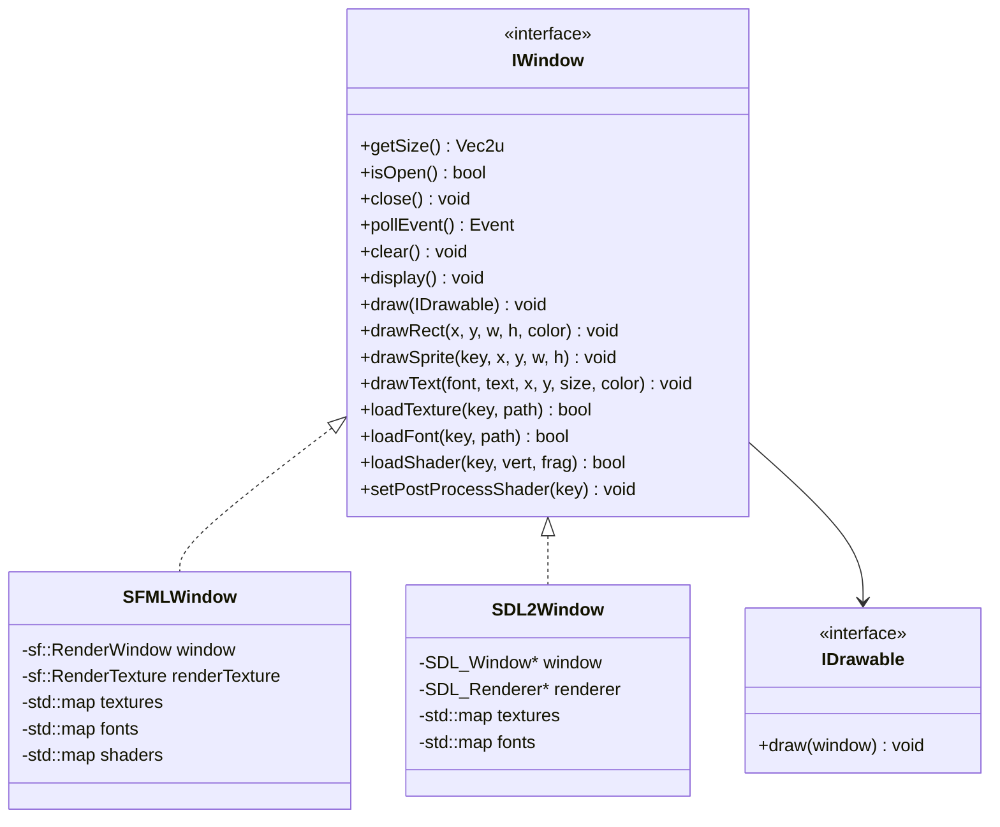

---
tags:
  - technique
  - graphiques
  - abstraction
---

# Couche d'Abstraction Graphique

Design et implémentation de l'interface graphique commune.

## Principes de Design

L'abstraction graphique suit plusieurs principes clés :

1. **Dependency Inversion** : Le code métier dépend d'abstractions, pas d'implémentations
2. **Single Responsibility** : Chaque interface a une responsabilité unique
3. **Plugin Architecture** : Les backends sont chargés dynamiquement
4. **RAII** : Gestion automatique des ressources

---

## Architecture



---

## Interface IWindow

L'interface principale du système graphique. Définie dans `src/client/include/graphics/IWindow.hpp`.

```cpp
namespace graphics {

class IWindow {
public:
    virtual ~IWindow() = default;

    // === Window Management ===
    virtual Vec2u getSize() const = 0;
    virtual bool isOpen() = 0;
    virtual void close() = 0;
    virtual events::Event pollEvent() = 0;

    // === Drawing ===
    virtual void draw(const IDrawable& drawable) = 0;
    virtual void drawRect(float x, float y, float width, float height, rgba color) = 0;
    virtual void drawImg(IDrawable drawable, float x, float y, float scaleX, float scaleY) = 0;
    virtual void drawSprite(const std::string& textureKey, float x, float y, float width, float height) = 0;
    virtual void drawText(const std::string& fontKey, const std::string& text,
                          float x, float y, unsigned int size, rgba color) = 0;

    // === Resource Loading ===
    virtual bool loadTexture(const std::string& key, const std::string& filepath) = 0;
    virtual bool loadFont(const std::string& key, const std::string& filepath) = 0;

    // === Frame Management ===
    virtual void clear() = 0;
    virtual void display() = 0;

    // === Post-Processing Shaders ===
    virtual bool loadShader(const std::string& key,
                           const std::string& vertexPath,
                           const std::string& fragmentPath) = 0;
    virtual void setPostProcessShader(const std::string& key) = 0;
    virtual void clearPostProcessShader() = 0;
    virtual void setShaderUniform(const std::string& name, int value) = 0;
    virtual bool supportsShaders() const = 0;

    // === Frame with Post-Processing ===
    virtual void beginFrame() = 0;
    virtual void endFrame() = 0;

    // === Native Handle ===
    virtual void* getNativeHandle() = 0;
};

} // namespace graphics
```

---

## Types Communs

### Vecteurs

Définis dans `src/client/include/utils/Vecs.hpp` :

```cpp
struct Vec2u {
    unsigned int x, y;
};

struct Vec2f {
    float x, y;
};
```

### Couleurs

```cpp
struct rgba {
    uint8_t r, g, b, a;
};
```

### Events

Le système d'événements utilise `std::variant` :

```cpp
namespace events {

using Event = std::variant<
    None,
    WindowClosed,
    KeyPressed,
    KeyReleased
>;

enum class Key {
    A, B, C, /* ... */ Z,
    Num0, Num1, /* ... */ Num9,
    Space, Enter, Escape,
    Up, Down, Left, Right,
    LShift, RShift, LControl, RControl
};

struct KeyPressed {
    Key key;
};

struct KeyReleased {
    Key key;
};

} // namespace events
```

---

## Implémentations

### SFML Backend

Localisation : `src/client/lib/sfml/`

```cpp
class SFMLWindow : public IWindow {
public:
    SFMLWindow(unsigned width, unsigned height, const std::string& title);

    // Utilise sf::RenderWindow pour le rendu
    // Supporte les shaders GLSL via sf::Shader
    // Post-processing via sf::RenderTexture

private:
    sf::RenderWindow _window;
    sf::RenderTexture _renderTexture;  // Pour post-processing
    std::map<std::string, sf::Texture> _textures;
    std::map<std::string, sf::Font> _fonts;
    std::map<std::string, sf::Shader> _shaders;
    std::string _activeShader;
};
```

### SDL2 Backend

Localisation : `src/client/lib/sdl2/`

```cpp
class SDL2Window : public IWindow {
public:
    SDL2Window(unsigned width, unsigned height, const std::string& title);

    // Utilise SDL_Renderer pour le rendu
    // Shaders NON supportés (supportsShaders() = false)

private:
    SDL_Window* _window;
    SDL_Renderer* _renderer;
    std::map<std::string, SDL_Texture*> _textures;
    std::map<std::string, TTF_Font*> _fonts;
};
```

!!! info "Mode Daltonien sans Shaders"
    SDL2 ne pouvant pas utiliser de shaders, le mode daltonien est géré via
    `AccessibilityConfig` qui fournit des **palettes de couleurs alternatives**.
    Voir [Accessibilité](../../configuration/accessibilite.md).

---

## Chargement Dynamique

Les backends sont compilés en bibliothèques partagées et chargés dynamiquement :

```
lib/
├── sfml/
│   └── librtype_sfml.so (ou .dll)
└── sdl2/
    └── librtype_sdl2.so (ou .dll)
```

Sélection via CLI :

```bash
# SFML (par défaut)
./rtype_client

# SDL2
./rtype_client --graphics=sdl2

# Plugin custom
./rtype_client --graphics-path=./mon_plugin.so
```

---

## Post-Processing Shaders

Le backend SFML supporte les shaders GLSL pour les effets post-processing :

```cpp
// Charger un shader
window->loadShader("colorblind", "shaders/passthrough.vert", "shaders/colorblind.frag");

// Activer le shader
window->setPostProcessShader("colorblind");

// Passer des uniforms
window->setShaderUniform("mode", 1);  // 1 = protanopia

// Render loop avec post-processing
window->beginFrame();
// ... draw everything ...
window->endFrame();  // Applique le shader
```

!!! warning "Support SDL2"
    Le backend SDL2 **ne supporte pas les shaders**. `supportsShaders()` retourne `false`.
    Pour le mode daltonien, SDL2 utilise `AccessibilityConfig` avec des palettes de couleurs.

---

## Utilisation dans le Code

### GameScene

```cpp
void GameScene::render() {
    auto& window = *_context.window;

    window.beginFrame();
    window.clear();

    // Dessiner le background
    window.drawSprite("background", 0, 0, 1920, 1080);

    // Dessiner les joueurs
    for (const auto& player : _players) {
        window.drawSprite("ship", player.x, player.y, 64, 64);
    }

    // Dessiner les missiles
    for (const auto& missile : _missiles) {
        window.drawSprite("missile", missile.x, missile.y, 32, 16);
    }

    // HUD
    window.drawText("font", "Score: " + std::to_string(_score),
                    10, 10, 24, {255, 255, 255, 255});

    window.endFrame();
    window.display();
}
```

### Chargement de ressources

```cpp
void GameScene::loadResources() {
    auto& window = *_context.window;

    // Textures
    window.loadTexture("ship", "assets/spaceship/Ship1.png");
    window.loadTexture("missile", "assets/spaceship/missile.png");
    window.loadTexture("background", "assets/backgrounds/space.png");

    // Fonts
    window.loadFont("font", "assets/fonts/main.ttf");

    // Shaders (SFML only)
    if (window.supportsShaders()) {
        window.loadShader("colorblind",
                         "assets/shaders/passthrough.vert",
                         "assets/shaders/colorblind.frag");
    }
}
```
