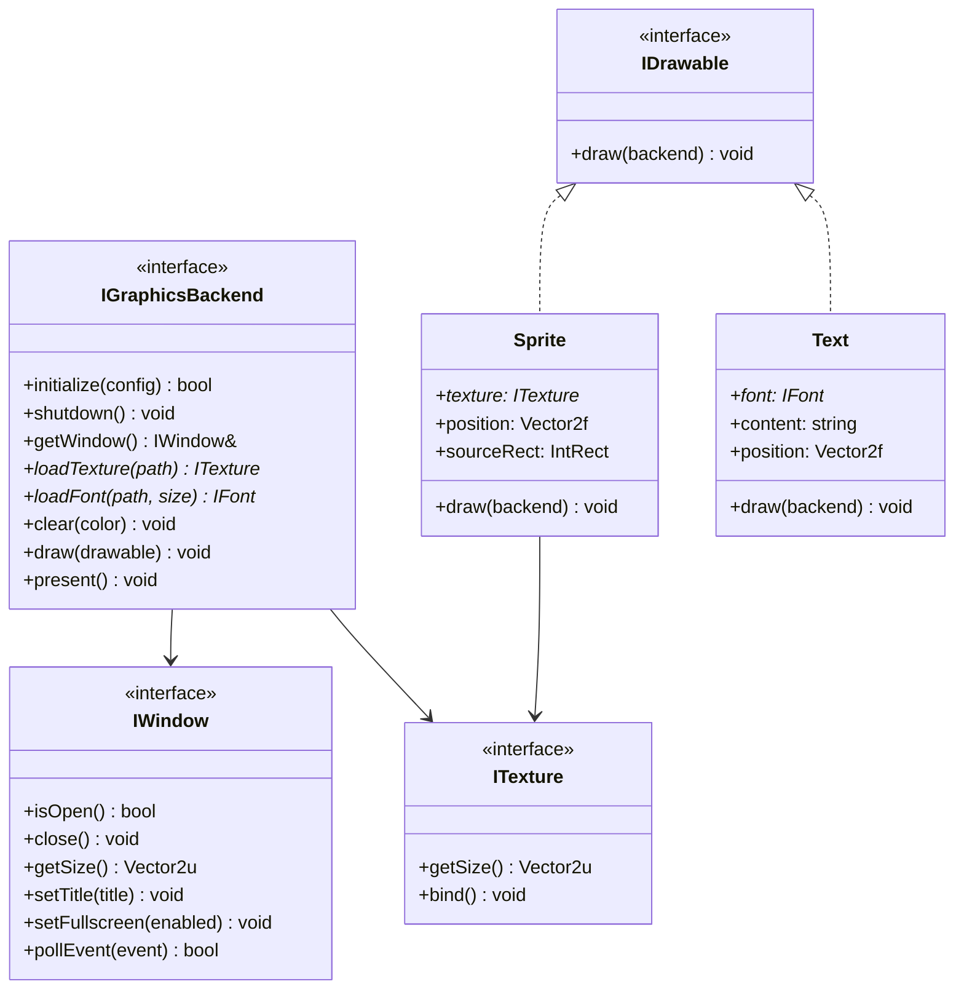

---
tags:
  - technique
  - graphiques
  - abstraction
---

# Couche d'Abstraction Graphique

Design et implémentation de l'interface graphique commune.

## Principes de Design

L'abstraction graphique suit plusieurs principes clés :

1. **Dependency Inversion** : Le code métier dépend d'abstractions, pas d'implémentations
2. **Single Responsibility** : Chaque interface a une responsabilité unique
3. **Interface Segregation** : Interfaces minimales et focalisées
4. **RAII** : Gestion automatique des ressources

---

## Diagramme de Classes



---

## Interfaces Core

### IGraphicsBackend

Interface principale du système graphique.

```cpp
namespace rtype::graphics {

struct WindowConfig {
    std::string title = "R-Type";
    uint32_t width = 1920;
    uint32_t height = 1080;
    bool fullscreen = false;
    bool vsync = true;
};

class IGraphicsBackend {
public:
    virtual ~IGraphicsBackend() = default;

    // === Lifecycle ===

    /// Initialize the graphics subsystem
    /// @param config Window configuration
    /// @return true on success
    virtual bool initialize(const WindowConfig& config) = 0;

    /// Cleanup all resources
    virtual void shutdown() = 0;

    // === Window ===

    /// Get the main window
    virtual IWindow& getWindow() = 0;

    // === Resource Loading ===

    /// Load a texture from file
    /// @param path Path to image file
    /// @return Texture or nullptr on failure
    virtual std::unique_ptr<ITexture> loadTexture(
        const std::filesystem::path& path) = 0;

    /// Load a font from file
    virtual std::unique_ptr<IFont> loadFont(
        const std::filesystem::path& path, int size) = 0;

    // === Rendering ===

    /// Clear the screen
    virtual void clear(Color color = Color::Black) = 0;

    /// Draw a drawable object
    virtual void draw(const IDrawable& drawable) = 0;

    /// Draw a sprite directly
    virtual void drawSprite(
        const ITexture& texture,
        const Vector2f& position,
        const IntRect& sourceRect = {},
        float rotation = 0.f,
        const Vector2f& scale = {1.f, 1.f}) = 0;

    /// Draw text directly
    virtual void drawText(
        const IFont& font,
        const std::string& text,
        const Vector2f& position,
        Color color = Color::White) = 0;

    /// Present the frame
    virtual void present() = 0;

    // === Info ===

    virtual std::string getName() const = 0;
};

} // namespace rtype::graphics
```

### IWindow

Interface de gestion de fenêtre.

```cpp
namespace rtype::graphics {

class IWindow {
public:
    virtual ~IWindow() = default;

    /// Check if window is open
    virtual bool isOpen() const = 0;

    /// Close the window
    virtual void close() = 0;

    /// Get window size
    virtual Vector2u getSize() const = 0;

    /// Set window title
    virtual void setTitle(const std::string& title) = 0;

    /// Toggle fullscreen
    virtual void setFullscreen(bool enabled) = 0;

    /// Poll next event
    /// @param event Output event
    /// @return true if event was available
    virtual bool pollEvent(Event& event) = 0;

    /// Check if window has focus
    virtual bool hasFocus() const = 0;
};

} // namespace rtype::graphics
```

### ITexture

Interface pour les textures.

```cpp
namespace rtype::graphics {

class ITexture {
public:
    virtual ~ITexture() = default;

    /// Get texture dimensions
    virtual Vector2u getSize() const = 0;

    /// Get native handle (for advanced usage)
    virtual void* getNativeHandle() const = 0;
};

} // namespace rtype::graphics
```

---

## Types Communs

```cpp
namespace rtype::graphics {

// === Vectors ===

template<typename T>
struct Vector2 {
    T x{}, y{};

    Vector2() = default;
    Vector2(T x, T y) : x(x), y(y) {}

    Vector2 operator+(const Vector2& o) const { return {x + o.x, y + o.y}; }
    Vector2 operator-(const Vector2& o) const { return {x - o.x, y - o.y}; }
    Vector2 operator*(T s) const { return {x * s, y * s}; }
};

using Vector2f = Vector2<float>;
using Vector2i = Vector2<int>;
using Vector2u = Vector2<unsigned>;

// === Rectangles ===

struct IntRect {
    int x{}, y{}, width{}, height{};

    bool contains(int px, int py) const {
        return px >= x && px < x + width &&
               py >= y && py < y + height;
    }
};

struct FloatRect {
    float x{}, y{}, width{}, height{};

    bool intersects(const FloatRect& other) const;
};

// === Color ===

struct Color {
    uint8_t r{}, g{}, b{}, a{255};

    Color() = default;
    Color(uint8_t r, uint8_t g, uint8_t b, uint8_t a = 255)
        : r(r), g(g), b(b), a(a) {}

    static const Color Black;
    static const Color White;
    static const Color Red;
    static const Color Green;
    static const Color Blue;
    static const Color Transparent;
};

// === Events ===

enum class EventType {
    Closed,
    Resized,
    KeyPressed,
    KeyReleased,
    MouseMoved,
    MouseButtonPressed,
    MouseButtonReleased
};

struct Event {
    EventType type;

    union {
        struct { int width, height; } size;
        struct { KeyCode code; bool alt, ctrl, shift; } key;
        struct { int x, y; } mouse;
        struct { int x, y; MouseButton button; } mouseButton;
    };
};

} // namespace rtype::graphics
```

---

## Pattern Factory

Création des backends via factory :

```cpp
namespace rtype::graphics {

/// Factory function type for backends
using BackendFactory = std::unique_ptr<IGraphicsBackend>(*)();

/// Registry of available backends
class BackendRegistry {
public:
    static BackendRegistry& instance();

    /// Register a backend factory
    void registerBackend(
        const std::string& name,
        BackendFactory factory);

    /// Create a backend by name
    std::unique_ptr<IGraphicsBackend> create(
        const std::string& name) const;

    /// List available backends
    std::vector<std::string> listBackends() const;

private:
    std::unordered_map<std::string, BackendFactory> factories_;
};

/// Macro for auto-registration
#define REGISTER_GRAPHICS_BACKEND(name, class_name) \
    static bool _registered_##class_name = [] { \
        BackendRegistry::instance().registerBackend( \
            name, \
            []() { return std::make_unique<class_name>(); } \
        ); \
        return true; \
    }()

} // namespace rtype::graphics
```

Usage dans les implémentations :

```cpp
// Dans SDL2Backend.cpp
REGISTER_GRAPHICS_BACKEND("sdl2", SDL2Backend);

// Dans SFMLBackend.cpp
REGISTER_GRAPHICS_BACKEND("sfml", SFMLBackend);
```

---

## Gestion des Ressources

### TextureCache

Cache intelligent pour les textures :

```cpp
class TextureCache {
public:
    TextureCache(IGraphicsBackend& backend) : backend_(backend) {}

    /// Get or load a texture
    ITexture* get(const std::string& path) {
        auto it = cache_.find(path);
        if (it != cache_.end()) {
            return it->second.get();
        }

        auto texture = backend_.loadTexture(path);
        if (!texture) {
            spdlog::error("Failed to load texture: {}", path);
            return nullptr;
        }

        auto* ptr = texture.get();
        cache_[path] = std::move(texture);
        return ptr;
    }

    /// Clear unused textures
    void cleanup() {
        // Implementation with reference counting
    }

private:
    IGraphicsBackend& backend_;
    std::unordered_map<std::string, std::unique_ptr<ITexture>> cache_;
};
```

---

## Exemple d'Utilisation

```cpp
#include "graphics/IGraphicsBackend.hpp"
#include "graphics/BackendRegistry.hpp"

int main() {
    using namespace rtype::graphics;

    // Create backend
    auto backend = BackendRegistry::instance().create("sdl2");
    if (!backend) {
        return 1;
    }

    // Initialize
    WindowConfig config{
        .title = "R-Type",
        .width = 1920,
        .height = 1080
    };

    if (!backend->initialize(config)) {
        return 1;
    }

    // Load resources
    auto playerTexture = backend->loadTexture("assets/player.png");

    // Game loop
    while (backend->getWindow().isOpen()) {
        Event event;
        while (backend->getWindow().pollEvent(event)) {
            if (event.type == EventType::Closed) {
                backend->getWindow().close();
            }
        }

        backend->clear(Color::Black);
        backend->drawSprite(*playerTexture, {100.f, 100.f});
        backend->present();
    }

    backend->shutdown();
    return 0;
}
```
