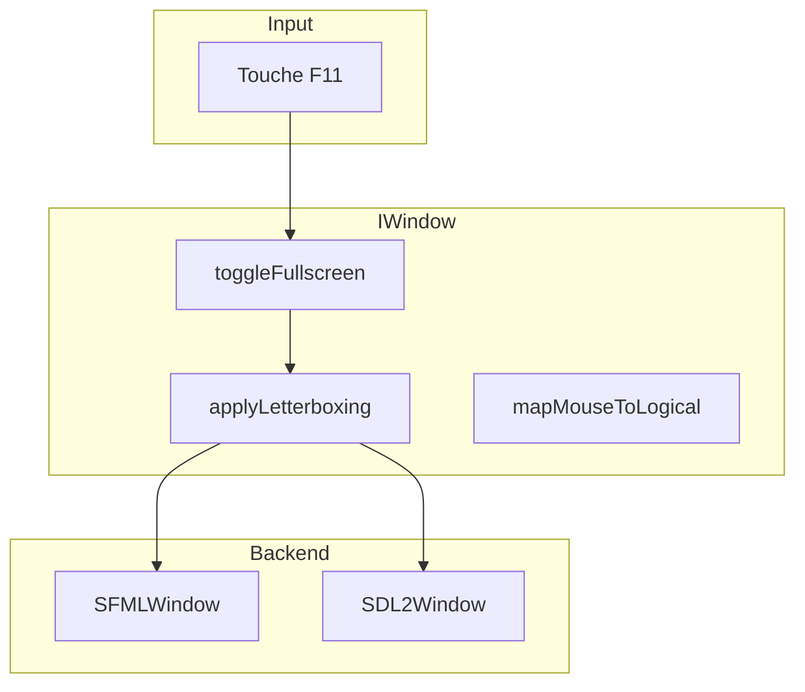

---
tags:
  - technique
  - graphiques
  - fullscreen
---

# Fullscreen & Letterboxing

Gestion du mode plein écran et du letterboxing pour maintenir le ratio 16:9.

## Vue d'ensemble

| Fonctionnalité | Description |
|----------------|-------------|
| **Toggle** | ++f11++ bascule entre fenêtré et plein écran |
| **Mode** | Desktop fullscreen (borderless) |
| **Résolution logique** | 1920×1080 (fixe) |
| **Letterboxing** | Barres noires automatiques pour conserver le ratio 16:9 |

---

## Architecture



---

## Implémentation SFML

SFML utilise `sf::View` pour gérer le viewport et le letterboxing.

### toggleFullscreen()

```cpp
void SFMLWindow::toggleFullscreen() {
    _isFullscreen = !_isFullscreen;

    if (_isFullscreen) {
        // Desktop fullscreen (borderless)
        _window.create(
            sf::VideoMode::getDesktopMode(),
            "R-Type",
            sf::Style::None
        );
    } else {
        // Fenêtré 1920x1080
        _window.create(
            sf::VideoMode(1920, 1080),
            "R-Type",
            sf::Style::Titlebar | sf::Style::Close
        );
    }

    applyLetterboxing();
}
```

### applyLetterboxing()

```cpp
void SFMLWindow::applyLetterboxing() {
    sf::Vector2u windowSize = _window.getSize();
    float windowRatio = static_cast<float>(windowSize.x) / windowSize.y;
    float targetRatio = 1920.0f / 1080.0f;  // 16:9

    sf::FloatRect viewport;

    if (windowRatio > targetRatio) {
        // Écran plus large que 16:9 → barres verticales
        float viewWidth = targetRatio / windowRatio;
        viewport = sf::FloatRect(
            (1.0f - viewWidth) / 2.0f,  // Centrer horizontalement
            0.0f,
            viewWidth,
            1.0f
        );
    } else {
        // Écran moins large que 16:9 → barres horizontales
        float viewHeight = windowRatio / targetRatio;
        viewport = sf::FloatRect(
            0.0f,
            (1.0f - viewHeight) / 2.0f,  // Centrer verticalement
            1.0f,
            viewHeight
        );
    }

    sf::View view(sf::FloatRect(0, 0, 1920, 1080));
    view.setViewport(viewport);
    _window.setView(view);
}
```

### Mapping souris

```cpp
Vec2f SFMLWindow::mapMouseToLogical(int x, int y) {
    sf::Vector2i pixelPos(x, y);
    sf::Vector2f worldPos = _window.mapPixelToCoords(pixelPos);
    return Vec2f(worldPos.x, worldPos.y);
}
```

!!! note "mapPixelToCoords"
    SFML gère automatiquement la conversion pixel → coordonnées logiques via `mapPixelToCoords()`, qui prend en compte le viewport actuel.

---

## Implémentation SDL2

SDL2 utilise `SDL_RenderSetLogicalSize()` qui gère automatiquement le letterboxing et le mapping souris.

### toggleFullscreen()

```cpp
void SDL2Window::toggleFullscreen() {
    _isFullscreen = !_isFullscreen;

    if (_isFullscreen) {
        SDL_SetWindowFullscreen(_window, SDL_WINDOW_FULLSCREEN_DESKTOP);
    } else {
        SDL_SetWindowFullscreen(_window, 0);
        SDL_SetWindowSize(_window, 1920, 1080);
    }
}
```

### applyLetterboxing()

```cpp
void SDL2Window::applyLetterboxing() {
    // SDL2 gère tout automatiquement !
    SDL_RenderSetLogicalSize(_renderer, 1920, 1080);
}
```

!!! tip "Avantage SDL2"
    `SDL_RenderSetLogicalSize()` gère automatiquement :

    - Le letterboxing (barres noires)
    - La conversion des coordonnées souris
    - Le scaling du rendu

    Pas besoin de calculs manuels comme avec SFML.

---

## Gestion des événements

### SFML

```cpp
void SFMLWindow::handleEvent(const sf::Event& event) {
    if (event.type == sf::Event::KeyPressed &&
        event.key.code == sf::Keyboard::F11) {
        toggleFullscreen();
    }

    if (event.type == sf::Event::Resized) {
        applyLetterboxing();
    }
}
```

### SDL2

```cpp
void SDL2Window::handleEvent(const SDL_Event& event) {
    if (event.type == SDL_KEYDOWN &&
        event.key.keysym.sym == SDLK_F11) {
        toggleFullscreen();
    }

    // SDL2 gère automatiquement le resize avec SDL_RenderSetLogicalSize
}
```

---

## Spécificités plateforme

### Linux (Ubuntu/Gnome)

Le gestionnaire de fenêtres peut redimensionner la fenêtre (barre des tâches). Le letterboxing gère ce cas automatiquement.

### Windows

Le mode "desktop fullscreen" (borderless) permet des transitions Alt+Tab rapides sans changement de résolution d'écran.

### macOS

Similaire à Windows, utilise le mode borderless fullscreen.

---

## Constantes

| Constante | Valeur | Description |
|-----------|--------|-------------|
| `LOGICAL_WIDTH` | 1920 | Largeur logique |
| `LOGICAL_HEIGHT` | 1080 | Hauteur logique |
| `TARGET_RATIO` | 1.777... | Ratio 16:9 (1920/1080) |

---

## Fichiers source

| Fichier | Description |
|---------|-------------|
| `src/client/lib/sfml/src/SFMLWindow.cpp` | Implémentation SFML |
| `src/client/lib/sdl2/src/SDL2Window.cpp` | Implémentation SDL2 |
| `src/client/include/graphics/IWindow.hpp` | Interface commune |
