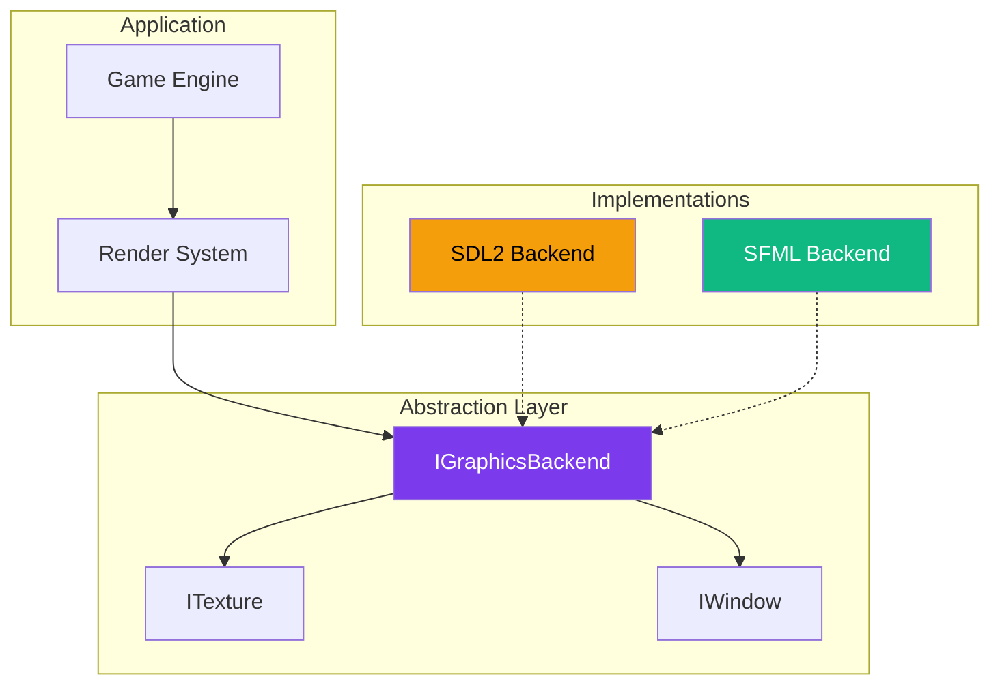
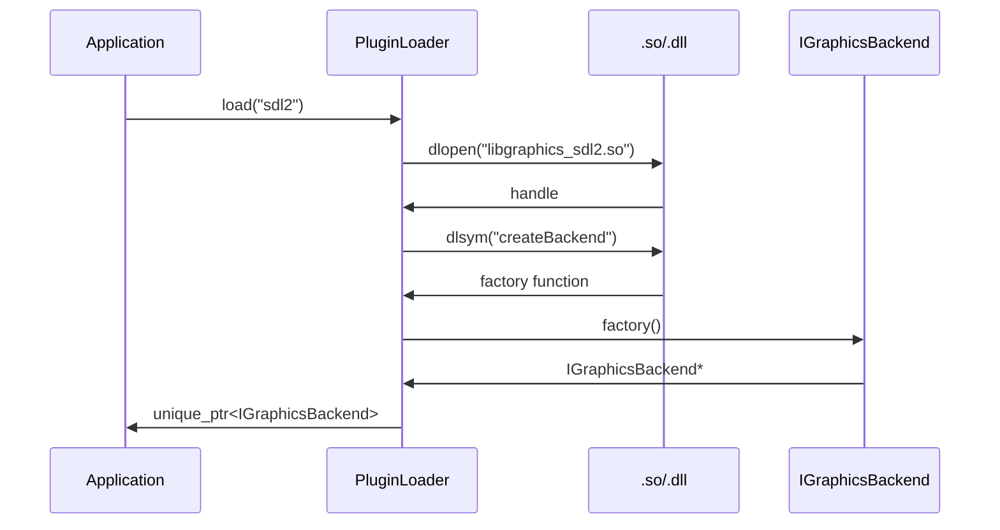

---
tags:
  - technique
  - graphiques
  - architecture
---

# Système Graphique

R-Type utilise une architecture **multi-backend** permettant de choisir entre SDL2 et SFML comme moteur de rendu.

## Architecture Multi-Backend



---

## Pourquoi Multi-Backend ?

| Avantage | Description |
|----------|-------------|
| **Flexibilité** | Choix du backend selon les besoins |
| **Portabilité** | Fallback si un backend ne fonctionne pas |
| **Performance** | Benchmark facile entre backends |
| **Pédagogie** | Démontre les design patterns |

---

## Backends Disponibles

<div class="grid-cards">
  <div class="card">
    <div class="card-icon">✨</div>
    <h3><a href="sfml/">SFML</a></h3>
    <p>Backend par défaut. API haut niveau, supporte les shaders.</p>
    <span class="badge badge-primary">Recommandé</span>
  </div>

  <div class="card">
    <div class="card-icon">🎮</div>
    <h3><a href="sdl2/">SDL2</a></h3>
    <p>Alternative légère. Pas de shaders, palette de couleurs pour accessibilité.</p>
    <span class="badge badge-secondary">Alternative</span>
  </div>
</div>

---

## Comparaison

| Critère | SDL2 | SFML |
|---------|------|------|
| **Paradigme** | C, procédural | C++, orienté objet |
| **Niveau d'abstraction** | Bas | Haut |
| **Performance** | ⭐⭐⭐⭐⭐ | ⭐⭐⭐⭐ |
| **Facilité d'utilisation** | ⭐⭐⭐ | ⭐⭐⭐⭐⭐ |
| **Fonctionnalités intégrées** | Minimal | Riche |
| **Contrôle fin** | ⭐⭐⭐⭐⭐ | ⭐⭐⭐ |

---

## Sélection du Backend

### Au Runtime

```bash
# SFML (par défaut)
./rtype_client

# SDL2 (alternative)
./rtype_client --graphics=sdl2

# Plugin custom
./rtype_client --graphics-path=./mon_plugin.so
```

### Dans la Configuration

```json
{
  "graphics": {
    "backend": "sfml"
  }
}
```

---

## Interface Abstraite

Le cœur du système repose sur l'interface `IGraphicsBackend` :

```cpp
namespace rtype::graphics {

class IGraphicsBackend {
public:
    virtual ~IGraphicsBackend() = default;

    // Lifecycle
    virtual bool initialize(const WindowConfig& config) = 0;
    virtual void shutdown() = 0;

    // Window
    virtual IWindow& getWindow() = 0;

    // Resources
    virtual std::unique_ptr<ITexture> loadTexture(const std::string& path) = 0;
    virtual std::unique_ptr<IFont> loadFont(const std::string& path, int size) = 0;

    // Rendering
    virtual void clear(Color color = Color::Black) = 0;
    virtual void draw(const IDrawable& drawable) = 0;
    virtual void present() = 0;

    // Info
    virtual std::string getName() const = 0;
    virtual Version getVersion() const = 0;
};

} // namespace rtype::graphics
```

[Voir la documentation complète de l'abstraction →](abstraction.md)

---

## Chargement Dynamique

Les backends sont compilés comme bibliothèques partagées et chargés dynamiquement :



```cpp
// Usage
auto backend = PluginLoader::load<IGraphicsBackend>(
    config.graphics.backend  // "sfml" ou "sdl2"
);

if (!backend) {
    spdlog::error("Failed to load backend: {}", config.graphics.backend);
    // Fallback sur SFML (défaut)
    backend = PluginLoader::load<IGraphicsBackend>("sfml");
}
```

---

## Fichiers Sources

```
src/client/graphics/
├── IGraphicsBackend.hpp     # Interface principale
├── IWindow.hpp              # Interface fenêtre
├── ITexture.hpp             # Interface texture
├── IDrawable.hpp            # Interface dessinable
├── Types.hpp                # Types communs (Color, Rect, etc.)
├── PluginLoader.hpp         # Chargement dynamique
├── sdl2/
│   ├── SDL2Backend.hpp
│   ├── SDL2Backend.cpp
│   ├── SDL2Window.hpp
│   ├── SDL2Texture.hpp
│   └── CMakeLists.txt
└── sfml/
    ├── SFMLBackend.hpp
    ├── SFMLBackend.cpp
    ├── SFMLWindow.hpp
    ├── SFMLTexture.hpp
    └── CMakeLists.txt
```

---

## Guides Détaillés

- [Couche d'Abstraction](abstraction.md) - Design de l'interface commune
- [Backend SDL2](sdl2.md) - Implémentation et spécificités SDL2
- [Backend SFML](sfml.md) - Implémentation et spécificités SFML
