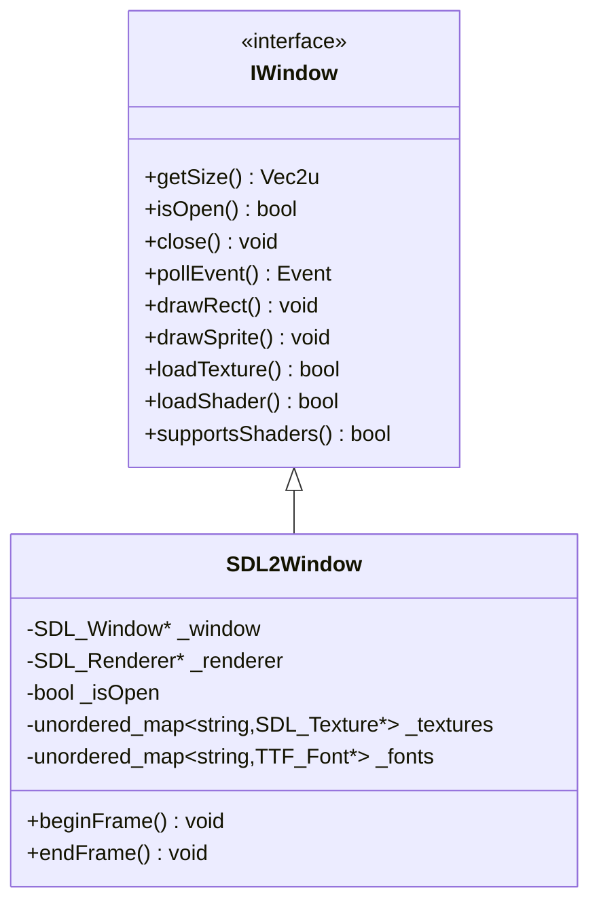

---
tags:
  - technique
  - graphiques
  - sdl2
---

# Backend SDL2

Implementation du backend graphique utilisant SDL2.

## Vue d'Ensemble

**SDL2** (Simple DirectMedia Layer) est une bibliotheque multimedia cross-platform ecrite en C. Elle fournit un acces bas niveau au hardware graphique.

### Caracteristiques

| Aspect | Description |
|--------|-------------|
| **Langage** | C (wrapper C++ dans notre implementation) |
| **Paradigme** | Procedural |
| **Rendu** | SDL_Renderer (accelere GPU) |
| **Extensions** | SDL2_image, SDL2_ttf, SDL2_mixer |

---

## Architecture



---

## Implementation

### SDL2Window.hpp

```cpp
/*
** EPITECH PROJECT, 2025
** rtype
** File description:
** SDL2Window
*/

#ifndef SDL2WINDOW_HPP_
#define SDL2WINDOW_HPP_

#include <SDL2/SDL.h>
#include <SDL2/SDL_ttf.h>
#include <string>
#include <unordered_map>

#include "graphics/IWindow.hpp"
#include "graphics/IDrawable.hpp"
#include "utils/Vecs.hpp"

class SDL2Window: public graphics::IWindow {
    public:
        SDL2Window(Vec2u winSize, const std::string& name);
        ~SDL2Window();

        Vec2u getSize() const override;
        bool isOpen() override;
        void close() override;
        events::Event pollEvent() override;

        void draw(const graphics::IDrawable& drawable) override;
        void drawRect(float x, float y, float width, float height, rgba color) override;
        void drawImg(graphics::IDrawable, float x, float y, float scaleX, float scaleY) override;
        bool loadTexture(const std::string& key, const std::string& filepath) override;
        void drawSprite(const std::string& textureKey, float x, float y, float width, float height) override;
        bool loadFont(const std::string& key, const std::string& filepath) override;
        void drawText(const std::string& fontKey, const std::string& text, float x, float y, unsigned int size, rgba color) override;

        void* getNativeHandle() override;

        void clear() override;
        void display() override;

        // Post-processing shader support (stubs - not supported in SDL2)
        bool loadShader(const std::string& key, const std::string& vertexPath, const std::string& fragmentPath) override;
        void setPostProcessShader(const std::string& key) override;
        void clearPostProcessShader() override;
        void setShaderUniform(const std::string& name, int value) override;
        bool supportsShaders() const override;

        // Frame management
        void beginFrame() override;
        void endFrame() override;

        SDL_Renderer* getRenderer() const { return _renderer; }

    private:
        SDL_Window* _window;
        SDL_Renderer* _renderer;
        bool _isOpen;
        bool _ttfInitialized = false;
        std::unordered_map<std::string, SDL_Texture*> _textures;
        std::unordered_map<std::string, TTF_Font*> _fonts;
};

#endif /* !SDL2WINDOW_HPP_ */
```

### SDL2Window.cpp (extraits)

```cpp
/*
** EPITECH PROJECT, 2025
** rtype
** File description:
** SDL2Window
*/

#include "SDL2Window.hpp"
#include "events/Event.hpp"
#include <SDL2/SDL.h>
#include <SDL2/SDL_image.h>
#include <SDL2/SDL_ttf.h>
#include <stdexcept>

static events::Key scancodeToKey(SDL_Scancode scancode)
{
    switch (scancode) {
        case SDL_SCANCODE_A: return events::Key::A;
        case SDL_SCANCODE_B: return events::Key::B;
        // ... autres touches
        case SDL_SCANCODE_SPACE: return events::Key::Space;
        case SDL_SCANCODE_RETURN: return events::Key::Enter;
        case SDL_SCANCODE_ESCAPE: return events::Key::Escape;
        default: return events::Key::Unknown;
    }
}

SDL2Window::SDL2Window(Vec2u winSize, const std::string& name)
    : _window(nullptr), _renderer(nullptr), _isOpen(true)
{
    // Windows: desactiver le DPI scaling pour avoir des pixels 1:1
    SDL_SetHint(SDL_HINT_WINDOWS_DPI_AWARENESS, "permonitorv2");
    SDL_SetHint(SDL_HINT_WINDOWS_DPI_SCALING, "0");

    if (SDL_Init(SDL_INIT_VIDEO) < 0) {
        throw std::runtime_error("Failed to initialize SDL: " + std::string(SDL_GetError()));
    }

    _window = SDL_CreateWindow(
        name.c_str(),
        SDL_WINDOWPOS_CENTERED,
        SDL_WINDOWPOS_CENTERED,
        static_cast<int>(winSize.x),
        static_cast<int>(winSize.y),
        SDL_WINDOW_SHOWN | SDL_WINDOW_RESIZABLE
    );

    if (!_window) {
        SDL_Quit();
        throw std::runtime_error("Failed to create SDL window: " + std::string(SDL_GetError()));
    }

    _renderer = SDL_CreateRenderer(_window, -1, SDL_RENDERER_ACCELERATED | SDL_RENDERER_PRESENTVSYNC);
    if (!_renderer) {
        SDL_DestroyWindow(_window);
        SDL_Quit();
        throw std::runtime_error("Failed to create SDL renderer: " + std::string(SDL_GetError()));
    }
}
```

### Destructeur avec cleanup RAII

```cpp
SDL2Window::~SDL2Window()
{
    // Cleanup textures
    for (auto& [key, texture] : _textures) {
        if (texture) {
            SDL_DestroyTexture(texture);
        }
    }
    _textures.clear();

    // Cleanup fonts
    for (auto& [key, font] : _fonts) {
        if (font) {
            TTF_CloseFont(font);
        }
    }
    _fonts.clear();

    if (_ttfInitialized) {
        TTF_Quit();
    }

    if (_renderer) {
        SDL_DestroyRenderer(_renderer);
    }
    if (_window) {
        SDL_DestroyWindow(_window);
    }
    SDL_Quit();
}
```

### Gestion des evenements

```cpp
events::Event SDL2Window::pollEvent()
{
    SDL_Event sdlEvent;
    if (SDL_PollEvent(&sdlEvent)) {
        switch (sdlEvent.type) {
            case SDL_QUIT:
                _isOpen = false;
                return events::WindowClosed{};
            case SDL_KEYDOWN:
                if (sdlEvent.key.repeat == 0)
                    return events::KeyPressed{scancodeToKey(sdlEvent.key.keysym.scancode)};
                break;
            case SDL_KEYUP:
                return events::KeyReleased{scancodeToKey(sdlEvent.key.keysym.scancode)};
            case SDL_MOUSEBUTTONDOWN:
                return events::MouseButtonPressed{
                    sdlButtonToMouseButton(sdlEvent.button.button),
                    sdlEvent.button.x,
                    sdlEvent.button.y
                };
            case SDL_MOUSEMOTION:
                return events::MouseMoved{
                    sdlEvent.motion.x,
                    sdlEvent.motion.y
                };
            case SDL_TEXTINPUT:
                if (sdlEvent.text.text[0] != '\0') {
                    return events::TextEntered{
                        static_cast<uint32_t>(static_cast<unsigned char>(sdlEvent.text.text[0]))
                    };
                }
                break;
            default:
                break;
        }
        return pollEvent();  // Continuer a vider la queue
    }
    return events::None{};
}
```

### Chargement et rendu de textures

```cpp
bool SDL2Window::loadTexture(const std::string& key, const std::string& filepath)
{
    if (_textures.count(key)) {
        return true;  // Deja charge
    }

    SDL_Surface* surface = IMG_Load(filepath.c_str());
    if (!surface) {
        return false;
    }

    SDL_Texture* texture = SDL_CreateTextureFromSurface(_renderer, surface);
    SDL_FreeSurface(surface);

    if (!texture) {
        return false;
    }

    _textures[key] = texture;
    return true;
}

void SDL2Window::drawSprite(const std::string& textureKey, float x, float y, float width, float height)
{
    auto it = _textures.find(textureKey);
    if (it == _textures.end()) {
        drawRect(x, y, width, height, {255, 0, 255, 255});  // Magenta = texture manquante
        return;
    }

    SDL_FRect destRect = {x, y, width, height};
    SDL_RenderCopyF(_renderer, it->second, nullptr, &destRect);
}
```

### Rendu de texte

```cpp
bool SDL2Window::loadFont(const std::string& key, const std::string& filepath)
{
    if (_fonts.count(key)) {
        return true;
    }

    if (!_ttfInitialized) {
        if (TTF_Init() < 0) {
            return false;
        }
        _ttfInitialized = true;
    }

    TTF_Font* font = TTF_OpenFont(filepath.c_str(), 16);
    if (!font) {
        return false;
    }

    _fonts[key] = font;
    return true;
}

void SDL2Window::drawText(const std::string& fontKey, const std::string& text, float x, float y, unsigned int size, rgba color)
{
    auto it = _fonts.find(fontKey);
    if (it == _fonts.end()) {
        return;
    }

    TTF_SetFontSize(it->second, static_cast<int>(size));
    SDL_Color sdlColor = {
        static_cast<Uint8>(color.r),
        static_cast<Uint8>(color.g),
        static_cast<Uint8>(color.b),
        static_cast<Uint8>(color.a)
    };
    SDL_Surface* surface = TTF_RenderText_Blended(it->second, text.c_str(), sdlColor);
    if (!surface) {
        return;
    }

    SDL_Texture* texture = SDL_CreateTextureFromSurface(_renderer, surface);
    SDL_FreeSurface(surface);
    if (!texture) {
        return;
    }

    int texW, texH;
    SDL_QueryTexture(texture, nullptr, nullptr, &texW, &texH);
    SDL_FRect destRect = {x, y, static_cast<float>(texW), static_cast<float>(texH)};
    SDL_RenderCopyF(_renderer, texture, nullptr, &destRect);
    SDL_DestroyTexture(texture);  // Cleanup texture temporaire
}
```

---

## Post-Processing (non supporte)

SDL2 ne supporte pas les shaders GLSL. Les methodes sont des stubs :

```cpp
bool SDL2Window::loadShader(const std::string& /*key*/, const std::string& /*vertexPath*/, const std::string& /*fragmentPath*/)
{
    return false;  // Non supporte
}

void SDL2Window::setPostProcessShader(const std::string& /*key*/)
{
    // Stub - non supporte
}

void SDL2Window::setShaderUniform(const std::string& /*name*/, int /*value*/)
{
    // Stub - non supporte
}

bool SDL2Window::supportsShaders() const
{
    return false;  // SDL2 ne supporte pas les shaders
}

void SDL2Window::beginFrame()
{
    clear();
}

void SDL2Window::endFrame()
{
    display();
}
```

---

## Accessibilite (modes daltoniens)

Puisque SDL2 ne supporte pas les shaders, les modes daltoniens utilisent des **palettes de couleurs distinctes** au lieu du post-processing :

```cpp
// Dans AccessibilityConfig.cpp
case ColorBlindMode::Deuteranopia:
    _playerColor        = {100, 100, 255, 255};  // Bleu (au lieu de cyan)
    _enemyColor         = {180, 100, 255, 255};  // Violet (au lieu de rouge)
    _playerMissileColor = {100, 255, 255, 255};  // Cyan (haut contraste)
    _enemyMissileColor  = {255, 150, 255, 255};  // Magenta
    break;
```

| Backend | Methode | Qualite | Performance |
|---------|---------|---------|-------------|
| **SFML** | Shader post-processing | Simulation medicalement precise | 1-2% overhead |
| **SDL2** | Palette remapping | Distinction visuelle | Negligeable |

---

## Gestion des Erreurs

SDL2 utilise des codes de retour et `SDL_GetError()` :

```cpp
if (SDL_Init(SDL_INIT_VIDEO) < 0) {
    throw std::runtime_error(
        "SDL_Init failed: " + std::string(SDL_GetError())
    );
}

// Verification texture
SDL_Texture* texture = SDL_CreateTextureFromSurface(_renderer, surface);
if (!texture) {
    // Gestion de l'erreur - retourner false ou throw
}
```

---

## Hints (Configuration Fine)

```cpp
// DPI awareness pour Windows
SDL_SetHint(SDL_HINT_WINDOWS_DPI_AWARENESS, "permonitorv2");
SDL_SetHint(SDL_HINT_WINDOWS_DPI_SCALING, "0");

// Activer le scaling lineaire
SDL_SetHint(SDL_HINT_RENDER_SCALE_QUALITY, "1");
```

---

## Dependances vcpkg

```json
{
  "dependencies": [
    "sdl2",
    "sdl2-image",
    "sdl2-ttf",
    "sdl2-mixer"
  ]
}
```

---

## Ressources

- [Documentation SDL2](https://wiki.libsdl.org/)
- [SDL2_image](https://wiki.libsdl.org/SDL2_image)
- [SDL2_ttf](https://wiki.libsdl.org/SDL2_ttf)
