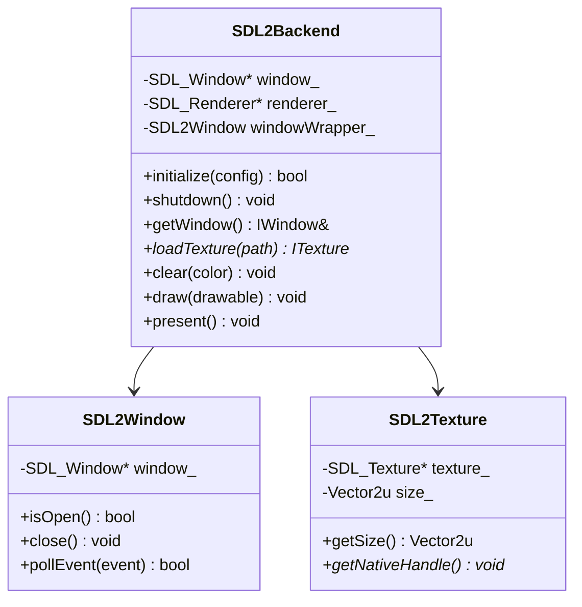

---
tags:
  - technique
  - graphiques
  - sdl2
---

# Backend SDL2

Implémentation du backend graphique utilisant SDL2.

## Vue d'Ensemble

**SDL2** (Simple DirectMedia Layer) est une bibliothèque multimédia cross-platform écrite en C. Elle fournit un accès bas niveau au hardware graphique.

### Caractéristiques

| Aspect | Description |
|--------|-------------|
| **Langage** | C (wrapper C++ dans notre implémentation) |
| **Paradigme** | Procédural |
| **Rendu** | SDL_Renderer (accéléré GPU) |
| **Extensions** | SDL2_image, SDL2_ttf, SDL2_mixer |

---

## Architecture



---

## Implémentation

### SDL2Backend.hpp

```cpp
#pragma once

#include "graphics/IGraphicsBackend.hpp"
#include "SDL2Window.hpp"
#include <SDL2/SDL.h>
#include <SDL2/SDL_image.h>
#include <SDL2/SDL_ttf.h>

namespace rtype::graphics::sdl2 {

class SDL2Backend : public IGraphicsBackend {
public:
    SDL2Backend() = default;
    ~SDL2Backend() override;

    // Lifecycle
    bool initialize(const WindowConfig& config) override;
    void shutdown() override;

    // Window
    IWindow& getWindow() override { return window_; }

    // Resources
    std::unique_ptr<ITexture> loadTexture(
        const std::filesystem::path& path) override;
    std::unique_ptr<IFont> loadFont(
        const std::filesystem::path& path, int size) override;

    // Rendering
    void clear(Color color) override;
    void draw(const IDrawable& drawable) override;
    void drawSprite(
        const ITexture& texture,
        const Vector2f& position,
        const IntRect& sourceRect,
        float rotation,
        const Vector2f& scale) override;
    void drawText(
        const IFont& font,
        const std::string& text,
        const Vector2f& position,
        Color color) override;
    void present() override;

    // Info
    std::string getName() const override { return "SDL2"; }

    // SDL-specific
    SDL_Renderer* getRenderer() const { return renderer_; }

private:
    SDL_Window* sdlWindow_ = nullptr;
    SDL_Renderer* renderer_ = nullptr;
    SDL2Window window_;
    bool initialized_ = false;
};

} // namespace rtype::graphics::sdl2
```

### SDL2Backend.cpp

```cpp
#include "SDL2Backend.hpp"
#include "SDL2Texture.hpp"
#include "SDL2Font.hpp"
#include <spdlog/spdlog.h>

namespace rtype::graphics::sdl2 {

SDL2Backend::~SDL2Backend() {
    if (initialized_) {
        shutdown();
    }
}

bool SDL2Backend::initialize(const WindowConfig& config) {
    // Initialize SDL2
    if (SDL_Init(SDL_INIT_VIDEO | SDL_INIT_EVENTS) < 0) {
        spdlog::error("SDL_Init failed: {}", SDL_GetError());
        return false;
    }

    // Initialize SDL2_image
    int imgFlags = IMG_INIT_PNG | IMG_INIT_JPG;
    if (!(IMG_Init(imgFlags) & imgFlags)) {
        spdlog::error("IMG_Init failed: {}", IMG_GetError());
        return false;
    }

    // Initialize SDL2_ttf
    if (TTF_Init() < 0) {
        spdlog::error("TTF_Init failed: {}", TTF_GetError());
        return false;
    }

    // Create window
    Uint32 windowFlags = SDL_WINDOW_SHOWN | SDL_WINDOW_RESIZABLE;
    if (config.fullscreen) {
        windowFlags |= SDL_WINDOW_FULLSCREEN_DESKTOP;
    }

    sdlWindow_ = SDL_CreateWindow(
        config.title.c_str(),
        SDL_WINDOWPOS_CENTERED,
        SDL_WINDOWPOS_CENTERED,
        config.width,
        config.height,
        windowFlags
    );

    if (!sdlWindow_) {
        spdlog::error("SDL_CreateWindow failed: {}", SDL_GetError());
        return false;
    }

    // Create renderer
    Uint32 rendererFlags = SDL_RENDERER_ACCELERATED;
    if (config.vsync) {
        rendererFlags |= SDL_RENDERER_PRESENTVSYNC;
    }

    renderer_ = SDL_CreateRenderer(sdlWindow_, -1, rendererFlags);
    if (!renderer_) {
        spdlog::error("SDL_CreateRenderer failed: {}", SDL_GetError());
        return false;
    }

    // Setup window wrapper
    window_.setSDLWindow(sdlWindow_);

    initialized_ = true;
    spdlog::info("SDL2 backend initialized successfully");
    return true;
}

void SDL2Backend::shutdown() {
    if (renderer_) {
        SDL_DestroyRenderer(renderer_);
        renderer_ = nullptr;
    }
    if (sdlWindow_) {
        SDL_DestroyWindow(sdlWindow_);
        sdlWindow_ = nullptr;
    }

    TTF_Quit();
    IMG_Quit();
    SDL_Quit();

    initialized_ = false;
    spdlog::info("SDL2 backend shutdown");
}

std::unique_ptr<ITexture> SDL2Backend::loadTexture(
    const std::filesystem::path& path)
{
    SDL_Surface* surface = IMG_Load(path.string().c_str());
    if (!surface) {
        spdlog::error("Failed to load image {}: {}",
            path.string(), IMG_GetError());
        return nullptr;
    }

    SDL_Texture* texture = SDL_CreateTextureFromSurface(
        renderer_, surface);
    SDL_FreeSurface(surface);

    if (!texture) {
        spdlog::error("Failed to create texture: {}", SDL_GetError());
        return nullptr;
    }

    return std::make_unique<SDL2Texture>(texture);
}

void SDL2Backend::clear(Color color) {
    SDL_SetRenderDrawColor(renderer_, color.r, color.g, color.b, color.a);
    SDL_RenderClear(renderer_);
}

void SDL2Backend::drawSprite(
    const ITexture& texture,
    const Vector2f& position,
    const IntRect& sourceRect,
    float rotation,
    const Vector2f& scale)
{
    auto* sdlTexture = static_cast<SDL_Texture*>(
        texture.getNativeHandle());

    auto size = texture.getSize();

    SDL_Rect src;
    if (sourceRect.width > 0 && sourceRect.height > 0) {
        src = {sourceRect.x, sourceRect.y,
               sourceRect.width, sourceRect.height};
    } else {
        src = {0, 0, static_cast<int>(size.x), static_cast<int>(size.y)};
    }

    SDL_FRect dst = {
        position.x,
        position.y,
        src.w * scale.x,
        src.h * scale.y
    };

    if (rotation != 0.f) {
        SDL_RenderCopyExF(renderer_, sdlTexture, &src, &dst,
            rotation, nullptr, SDL_FLIP_NONE);
    } else {
        SDL_RenderCopyF(renderer_, sdlTexture, &src, &dst);
    }
}

void SDL2Backend::present() {
    SDL_RenderPresent(renderer_);
}

// Auto-registration
REGISTER_GRAPHICS_BACKEND("sdl2", SDL2Backend);

} // namespace rtype::graphics::sdl2
```

---

## SDL2Texture

```cpp
#pragma once

#include "graphics/ITexture.hpp"
#include <SDL2/SDL.h>

namespace rtype::graphics::sdl2 {

class SDL2Texture : public ITexture {
public:
    explicit SDL2Texture(SDL_Texture* texture)
        : texture_(texture)
    {
        int w, h;
        SDL_QueryTexture(texture_, nullptr, nullptr, &w, &h);
        size_ = {static_cast<unsigned>(w), static_cast<unsigned>(h)};
    }

    ~SDL2Texture() override {
        if (texture_) {
            SDL_DestroyTexture(texture_);
        }
    }

    // Non-copyable
    SDL2Texture(const SDL2Texture&) = delete;
    SDL2Texture& operator=(const SDL2Texture&) = delete;

    // Movable
    SDL2Texture(SDL2Texture&& other) noexcept
        : texture_(other.texture_), size_(other.size_)
    {
        other.texture_ = nullptr;
    }

    Vector2u getSize() const override { return size_; }

    void* getNativeHandle() const override {
        return texture_;
    }

private:
    SDL_Texture* texture_;
    Vector2u size_;
};

} // namespace rtype::graphics::sdl2
```

---

## SDL2Window

```cpp
#pragma once

#include "graphics/IWindow.hpp"
#include <SDL2/SDL.h>

namespace rtype::graphics::sdl2 {

class SDL2Window : public IWindow {
public:
    void setSDLWindow(SDL_Window* window) { window_ = window; }

    bool isOpen() const override { return open_; }

    void close() override { open_ = false; }

    Vector2u getSize() const override {
        int w, h;
        SDL_GetWindowSize(window_, &w, &h);
        return {static_cast<unsigned>(w), static_cast<unsigned>(h)};
    }

    void setTitle(const std::string& title) override {
        SDL_SetWindowTitle(window_, title.c_str());
    }

    void setFullscreen(bool enabled) override {
        SDL_SetWindowFullscreen(window_,
            enabled ? SDL_WINDOW_FULLSCREEN_DESKTOP : 0);
    }

    bool pollEvent(Event& event) override {
        SDL_Event sdlEvent;
        if (!SDL_PollEvent(&sdlEvent)) {
            return false;
        }

        switch (sdlEvent.type) {
            case SDL_QUIT:
                event.type = EventType::Closed;
                break;
            case SDL_WINDOWEVENT:
                if (sdlEvent.window.event == SDL_WINDOWEVENT_RESIZED) {
                    event.type = EventType::Resized;
                    event.size.width = sdlEvent.window.data1;
                    event.size.height = sdlEvent.window.data2;
                }
                break;
            case SDL_KEYDOWN:
                event.type = EventType::KeyPressed;
                event.key.code = mapSDLKey(sdlEvent.key.keysym.sym);
                break;
            case SDL_KEYUP:
                event.type = EventType::KeyReleased;
                event.key.code = mapSDLKey(sdlEvent.key.keysym.sym);
                break;
            default:
                return pollEvent(event); // Get next event
        }
        return true;
    }

    bool hasFocus() const override {
        return SDL_GetWindowFlags(window_) & SDL_WINDOW_INPUT_FOCUS;
    }

private:
    KeyCode mapSDLKey(SDL_Keycode key);

    SDL_Window* window_ = nullptr;
    bool open_ = true;
};

} // namespace rtype::graphics::sdl2
```

---

## Spécificités SDL2

### Gestion des Erreurs

SDL2 utilise des codes de retour et `SDL_GetError()` :

```cpp
if (SDL_Init(SDL_INIT_VIDEO) < 0) {
    throw std::runtime_error(
        fmt::format("SDL_Init failed: {}", SDL_GetError())
    );
}
```

### Hints (Configuration Fine)

```cpp
// Activer le scaling linéaire
SDL_SetHint(SDL_HINT_RENDER_SCALE_QUALITY, "1");

// Forcer le driver OpenGL
SDL_SetHint(SDL_HINT_RENDER_DRIVER, "opengl");

// VSync adaptatif
SDL_SetHint(SDL_HINT_RENDER_VSYNC, "1");
```

### Batch Rendering

SDL2 supporte le batching pour optimiser les draw calls :

```cpp
// Dans SDL2Backend::initialize()
SDL_SetRenderDrawBlendMode(renderer_, SDL_BLENDMODE_BLEND);

// Le batching est automatique avec SDL 2.0.10+
```

---

## Dépendances vcpkg

```json
{
  "dependencies": [
    "sdl2",
    "sdl2-image",
    "sdl2-ttf",
    "sdl2-mixer"
  ]
}
```

---

## Ressources

- [Documentation SDL2](https://wiki.libsdl.org/)
- [SDL2_image](https://wiki.libsdl.org/SDL2_image)
- [SDL2_ttf](https://wiki.libsdl.org/SDL2_ttf)
