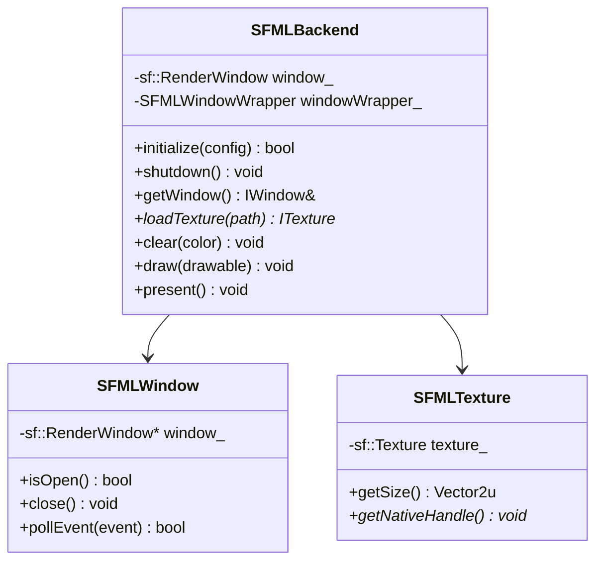

---
tags:
  - technique
  - graphiques
  - sfml
---

# Backend SFML

Implémentation du backend graphique utilisant SFML.

## Vue d'Ensemble

**SFML** (Simple and Fast Multimedia Library) est une bibliothèque multimédia orientée objet écrite en C++. Elle offre une API de haut niveau, intuitive et moderne.

### Caractéristiques

| Aspect | Description |
|--------|-------------|
| **Langage** | C++ natif |
| **Paradigme** | Orienté objet |
| **Rendu** | OpenGL (encapsulé) |
| **Modules** | Graphics, Window, Audio, Network, System |

---

## Architecture



---

## Implémentation

### SFMLBackend.hpp

```cpp
#pragma once

#include "graphics/IGraphicsBackend.hpp"
#include "SFMLWindow.hpp"
#include <SFML/Graphics.hpp>

namespace rtype::graphics::sfml {

class SFMLBackend : public IGraphicsBackend {
public:
    SFMLBackend() = default;
    ~SFMLBackend() override;

    // Lifecycle
    bool initialize(const WindowConfig& config) override;
    void shutdown() override;

    // Window
    IWindow& getWindow() override { return windowWrapper_; }

    // Resources
    std::unique_ptr<ITexture> loadTexture(
        const std::filesystem::path& path) override;
    std::unique_ptr<IFont> loadFont(
        const std::filesystem::path& path, int size) override;

    // Rendering
    void clear(Color color) override;
    void draw(const IDrawable& drawable) override;
    void drawSprite(
        const ITexture& texture,
        const Vector2f& position,
        const IntRect& sourceRect,
        float rotation,
        const Vector2f& scale) override;
    void drawText(
        const IFont& font,
        const std::string& text,
        const Vector2f& position,
        Color color) override;
    void present() override;

    // Info
    std::string getName() const override { return "SFML"; }

    // SFML-specific
    sf::RenderWindow& getRenderWindow() { return window_; }

private:
    sf::RenderWindow window_;
    SFMLWindow windowWrapper_;
    bool initialized_ = false;
};

} // namespace rtype::graphics::sfml
```

### SFMLBackend.cpp

```cpp
#include "SFMLBackend.hpp"
#include "SFMLTexture.hpp"
#include "SFMLFont.hpp"
#include <spdlog/spdlog.h>

namespace rtype::graphics::sfml {

SFMLBackend::~SFMLBackend() {
    if (initialized_) {
        shutdown();
    }
}

bool SFMLBackend::initialize(const WindowConfig& config) {
    // Window style
    sf::Uint32 style = sf::Style::Close | sf::Style::Resize;
    if (config.fullscreen) {
        style = sf::Style::Fullscreen;
    }

    // Create window
    window_.create(
        sf::VideoMode(config.width, config.height),
        config.title,
        style
    );

    if (!window_.isOpen()) {
        spdlog::error("Failed to create SFML window");
        return false;
    }

    // Configure
    window_.setVerticalSyncEnabled(config.vsync);
    window_.setFramerateLimit(config.vsync ? 0 : 144);

    // Setup wrapper
    windowWrapper_.setRenderWindow(&window_);

    initialized_ = true;
    spdlog::info("SFML backend initialized successfully");
    return true;
}

void SFMLBackend::shutdown() {
    if (window_.isOpen()) {
        window_.close();
    }
    initialized_ = false;
    spdlog::info("SFML backend shutdown");
}

std::unique_ptr<ITexture> SFMLBackend::loadTexture(
    const std::filesystem::path& path)
{
    auto texture = std::make_unique<SFMLTexture>();
    if (!texture->loadFromFile(path.string())) {
        spdlog::error("Failed to load texture: {}", path.string());
        return nullptr;
    }
    return texture;
}

std::unique_ptr<IFont> SFMLBackend::loadFont(
    const std::filesystem::path& path, int size)
{
    auto font = std::make_unique<SFMLFont>();
    if (!font->loadFromFile(path.string())) {
        spdlog::error("Failed to load font: {}", path.string());
        return nullptr;
    }
    font->setCharacterSize(size);
    return font;
}

void SFMLBackend::clear(Color color) {
    window_.clear(sf::Color(color.r, color.g, color.b, color.a));
}

void SFMLBackend::draw(const IDrawable& drawable) {
    drawable.draw(*this);
}

void SFMLBackend::drawSprite(
    const ITexture& texture,
    const Vector2f& position,
    const IntRect& sourceRect,
    float rotation,
    const Vector2f& scale)
{
    auto* sfmlTexture = static_cast<const sf::Texture*>(
        texture.getNativeHandle());

    sf::Sprite sprite(*sfmlTexture);
    sprite.setPosition(position.x, position.y);

    if (sourceRect.width > 0 && sourceRect.height > 0) {
        sprite.setTextureRect(sf::IntRect(
            sourceRect.x, sourceRect.y,
            sourceRect.width, sourceRect.height
        ));
    }

    sprite.setRotation(rotation);
    sprite.setScale(scale.x, scale.y);

    window_.draw(sprite);
}

void SFMLBackend::drawText(
    const IFont& font,
    const std::string& text,
    const Vector2f& position,
    Color color)
{
    auto* sfmlFont = static_cast<const SFMLFont*>(&font);

    sf::Text sfText;
    sfText.setFont(sfmlFont->getFont());
    sfText.setString(text);
    sfText.setPosition(position.x, position.y);
    sfText.setFillColor(sf::Color(color.r, color.g, color.b, color.a));
    sfText.setCharacterSize(sfmlFont->getCharacterSize());

    window_.draw(sfText);
}

void SFMLBackend::present() {
    window_.display();
}

// Auto-registration
REGISTER_GRAPHICS_BACKEND("sfml", SFMLBackend);

} // namespace rtype::graphics::sfml
```

---

## SFMLTexture

```cpp
#pragma once

#include "graphics/ITexture.hpp"
#include <SFML/Graphics/Texture.hpp>

namespace rtype::graphics::sfml {

class SFMLTexture : public ITexture {
public:
    SFMLTexture() = default;

    bool loadFromFile(const std::string& path) {
        return texture_.loadFromFile(path);
    }

    Vector2u getSize() const override {
        auto size = texture_.getSize();
        return {size.x, size.y};
    }

    void* getNativeHandle() const override {
        return const_cast<sf::Texture*>(&texture_);
    }

    const sf::Texture& getTexture() const { return texture_; }

private:
    sf::Texture texture_;
};

} // namespace rtype::graphics::sfml
```

---

## SFMLWindow

```cpp
#pragma once

#include "graphics/IWindow.hpp"
#include <SFML/Graphics/RenderWindow.hpp>

namespace rtype::graphics::sfml {

class SFMLWindow : public IWindow {
public:
    void setRenderWindow(sf::RenderWindow* window) {
        window_ = window;
    }

    bool isOpen() const override {
        return window_ && window_->isOpen();
    }

    void close() override {
        if (window_) {
            window_->close();
        }
    }

    Vector2u getSize() const override {
        auto size = window_->getSize();
        return {size.x, size.y};
    }

    void setTitle(const std::string& title) override {
        window_->setTitle(title);
    }

    void setFullscreen(bool enabled) override {
        // SFML requires recreating the window for fullscreen toggle
        auto size = window_->getSize();
        auto title = "R-Type"; // Store title somewhere

        window_->close();
        window_->create(
            enabled ? sf::VideoMode::getDesktopMode()
                    : sf::VideoMode(size.x, size.y),
            title,
            enabled ? sf::Style::Fullscreen
                    : (sf::Style::Close | sf::Style::Resize)
        );
    }

    bool pollEvent(Event& event) override {
        sf::Event sfEvent;
        if (!window_->pollEvent(sfEvent)) {
            return false;
        }

        switch (sfEvent.type) {
            case sf::Event::Closed:
                event.type = EventType::Closed;
                break;
            case sf::Event::Resized:
                event.type = EventType::Resized;
                event.size.width = sfEvent.size.width;
                event.size.height = sfEvent.size.height;
                break;
            case sf::Event::KeyPressed:
                event.type = EventType::KeyPressed;
                event.key.code = mapSFMLKey(sfEvent.key.code);
                event.key.alt = sfEvent.key.alt;
                event.key.ctrl = sfEvent.key.control;
                event.key.shift = sfEvent.key.shift;
                break;
            case sf::Event::KeyReleased:
                event.type = EventType::KeyReleased;
                event.key.code = mapSFMLKey(sfEvent.key.code);
                break;
            default:
                return pollEvent(event);
        }
        return true;
    }

    bool hasFocus() const override {
        return window_->hasFocus();
    }

private:
    KeyCode mapSFMLKey(sf::Keyboard::Key key);

    sf::RenderWindow* window_ = nullptr;
};

} // namespace rtype::graphics::sfml
```

---

## Spécificités SFML

### API Orientée Objet

SFML utilise un paradigme OOP natif :

```cpp
// Création directe d'objets
sf::Texture texture;
texture.loadFromFile("sprite.png");

sf::Sprite sprite(texture);
sprite.setPosition(100.f, 200.f);
sprite.setRotation(45.f);

window.draw(sprite);
```

### Drawable Interface

SFML fournit sa propre interface Drawable :

```cpp
class CustomShape : public sf::Drawable {
private:
    void draw(sf::RenderTarget& target, sf::RenderStates states) const override {
        // Custom drawing logic
    }
};
```

### Vertex Arrays (Optimisation)

Pour des performances maximales :

```cpp
sf::VertexArray vertices(sf::Quads, 4);

vertices[0].position = sf::Vector2f(0, 0);
vertices[1].position = sf::Vector2f(100, 0);
vertices[2].position = sf::Vector2f(100, 100);
vertices[3].position = sf::Vector2f(0, 100);

// Batch draw
window.draw(vertices, &texture);
```

### Views (Caméra)

SFML gère les vues/caméras nativement :

```cpp
sf::View view(sf::FloatRect(0, 0, 1920, 1080));
view.setCenter(player.getPosition());
view.zoom(0.5f);  // Zoom in

window.setView(view);
```

---

## Comparaison des Approches

| Aspect | SDL2 | SFML |
|--------|------|------|
| Chargement texture | `IMG_Load()` + `SDL_CreateTextureFromSurface()` | `texture.loadFromFile()` |
| Dessin | `SDL_RenderCopy()` | `window.draw(sprite)` |
| Rotation | Via `SDL_RenderCopyEx()` | `sprite.setRotation()` |
| Vue/Caméra | Manuel (transform matrices) | `sf::View` intégré |

---

## Dépendances vcpkg

```json
{
  "dependencies": [
    "sfml"
  ]
}
```

!!! note "SFML 3.0"
    SFML 3.0 est en développement avec une API modernisée (C++17).
    Notre implémentation cible SFML 2.6.x pour la stabilité.

---

## Ressources

- [Documentation SFML](https://www.sfml-dev.org/documentation/)
- [Tutoriels SFML](https://www.sfml-dev.org/tutorials/)
- [GitHub SFML](https://github.com/SFML/SFML)
