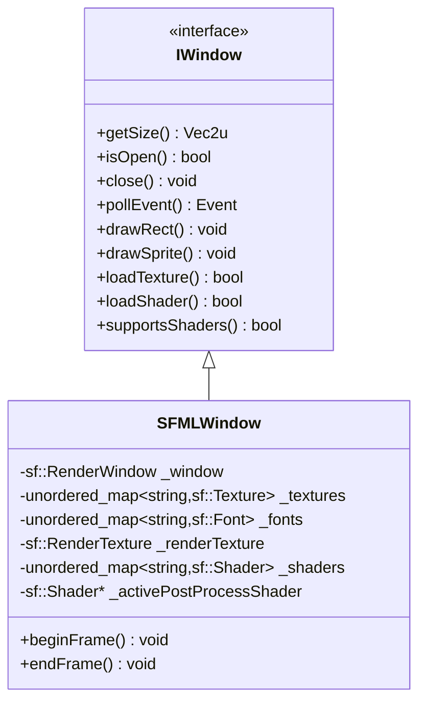

---
tags:
  - technique
  - graphiques
  - sfml
---

# Backend SFML

Implementation du backend graphique utilisant SFML.

## Vue d'Ensemble

**SFML** (Simple and Fast Multimedia Library) est une bibliotheque multimedia orientee objet ecrite en C++. Elle offre une API de haut niveau, intuitive et moderne.

### Caracteristiques

| Aspect | Description |
|--------|-------------|
| **Langage** | C++ natif |
| **Paradigme** | Oriente objet |
| **Rendu** | OpenGL (encapsule) |
| **Modules** | Graphics, Window, Audio, Network, System |
| **Version** | SFML 3.x |

---

## Architecture



---

## Implementation

### SFMLWindow.hpp

```cpp
/*
** EPITECH PROJECT, 2025
** rtype [WSL: Ubuntu-24.04]
** File description:
** SFMLWindow
*/

#ifndef SFMLWINDOW_HPP_
#define SFMLWINDOW_HPP_

#include <SFML/Graphics/Sprite.hpp>
#include <SFML/System/Vector2.hpp>
#include <SFML/Graphics.hpp>

#include <iostream>
#include <unordered_map>

#include "graphics/IWindow.hpp"
#include "graphics/IDrawable.hpp"
#include "utils/Vecs.hpp"

class SFMLWindow: public graphics::IWindow {
    public:
        SFMLWindow(Vec2u winSize, const std::string& name);
        Vec2u getSize() const override;
        bool isOpen() override;
        void close() override;
        events::Event pollEvent() override;

        void draw(const graphics::IDrawable& drawable) override;
        void draw(sf::Sprite& sprite);
        void drawRect(float x, float y, float width, float height, rgba color) override;
        void drawImg(graphics::IDrawable, float x, float y, float scaleX, float scaleY) override;
        bool loadTexture(const std::string& key, const std::string& filepath) override;
        void drawSprite(const std::string& textureKey, float x, float y, float width, float height) override;
        bool loadFont(const std::string& key, const std::string& filepath) override;
        void drawText(const std::string& fontKey, const std::string& text, float x, float y, unsigned int size, rgba color) override;

        void* getNativeHandle() override;

        void clear() override;
        void display() override;

        // Post-processing shader support
        bool loadShader(const std::string& key, const std::string& vertexPath, const std::string& fragmentPath) override;
        void setPostProcessShader(const std::string& key) override;
        void clearPostProcessShader() override;
        void setShaderUniform(const std::string& name, int value) override;
        bool supportsShaders() const override;

        // Frame management with post-processing
        void beginFrame() override;
        void endFrame() override;

    private:
        sf::RenderWindow _window;
        std::unordered_map<std::string, sf::Texture> _textures;
        std::unordered_map<std::string, sf::Font> _fonts;

        // Post-processing pipeline
        sf::RenderTexture _renderTexture;
        std::unordered_map<std::string, sf::Shader> _shaders;
        sf::Shader* _activePostProcessShader = nullptr;
        bool _renderTextureInitialized = false;

        void initRenderTexture();
        sf::RenderTarget& getRenderTarget();
};

#endif /* !SFMLWINDOW_HPP_ */
```

### SFMLWindow.cpp (extraits)

```cpp
/*
** EPITECH PROJECT, 2025
** rtype [WSL: Ubuntu-24.04]
** File description:
** SFMLWindow
*/

#include "SFMLWindow.hpp"
#include "events/Event.hpp"
#include <SFML/Window/Event.hpp>
#include <SFML/Window/Keyboard.hpp>

static events::Key scancodeToKey(sf::Keyboard::Scancode scancode)
{
    switch (scancode) {
        case sf::Keyboard::Scancode::A: return events::Key::A;
        case sf::Keyboard::Scancode::B: return events::Key::B;
        // ... autres touches
        case sf::Keyboard::Scancode::Space: return events::Key::Space;
        case sf::Keyboard::Scancode::Enter: return events::Key::Enter;
        case sf::Keyboard::Scancode::Escape: return events::Key::Escape;
        default: return events::Key::Unknown;
    }
}

SFMLWindow::SFMLWindow(Vec2u winSize, const std::string& name) {
    _window.create(sf::VideoMode({winSize.x, winSize.y}), name);
}

Vec2u SFMLWindow::getSize() const {
    return Vec2u(_window.getSize().x, _window.getSize().y);
}

bool SFMLWindow::isOpen() {
    return _window.isOpen();
}

void SFMLWindow::close() {
    return _window.close();
}

events::Event SFMLWindow::pollEvent() {
    if (auto ev = _window.pollEvent()) {
        if (ev->is<sf::Event::Closed>()) {
            _window.close();
            return events::WindowClosed{};
        }
        if (const auto* keyPressed = ev->getIf<sf::Event::KeyPressed>()) {
            return events::KeyPressed{scancodeToKey(keyPressed->scancode)};
        }
        if (const auto* keyReleased = ev->getIf<sf::Event::KeyReleased>()) {
            return events::KeyReleased{scancodeToKey(keyReleased->scancode)};
        }
        // ... autres evenements
    }
    return events::None{};
}
```

### Chargement de ressources

```cpp
bool SFMLWindow::loadTexture(const std::string& key, const std::string& filepath) {
    if (_textures.count(key)) {
        return true;  // Deja charge
    }

    sf::Texture texture;
    if (!texture.loadFromFile(filepath)) {
        return false;
    }

    _textures[key] = std::move(texture);
    return true;
}

void SFMLWindow::drawSprite(const std::string& textureKey, float x, float y, float width, float height) {
    auto it = _textures.find(textureKey);
    if (it == _textures.end()) {
        drawRect(x, y, width, height, {255, 0, 255, 255});  // Magenta = texture manquante
        return;
    }

    sf::Sprite sprite(it->second);
    sprite.setPosition({x, y});

    sf::Vector2u texSize = it->second.getSize();
    if (texSize.x > 0 && texSize.y > 0) {
        float scaleX = width / static_cast<float>(texSize.x);
        float scaleY = height / static_cast<float>(texSize.y);
        sprite.setScale({scaleX, scaleY});
    }

    getRenderTarget().draw(sprite);
}
```

---

## Pipeline Post-Processing

SFML supporte les shaders GLSL pour le post-processing (ex: modes daltoniens).

### Initialisation

```cpp
void SFMLWindow::initRenderTexture() {
    if (_renderTextureInitialized) return;

    auto size = _window.getSize();
    if (!_renderTexture.resize({size.x, size.y})) {
        return;
    }
    _renderTextureInitialized = true;
}

sf::RenderTarget& SFMLWindow::getRenderTarget() {
    if (_renderTextureInitialized && _activePostProcessShader) {
        return _renderTexture;  // Render to texture
    }
    return _window;  // Render direct
}
```

### Chargement et application

```cpp
bool SFMLWindow::loadShader(const std::string& key, const std::string& vertexPath, const std::string& fragmentPath) {
    if (_shaders.count(key)) {
        return true;
    }

    sf::Shader shader;
    if (!shader.loadFromFile(vertexPath, fragmentPath)) {
        return false;
    }

    _shaders[key] = std::move(shader);
    return true;
}

void SFMLWindow::setPostProcessShader(const std::string& key) {
    auto it = _shaders.find(key);
    if (it != _shaders.end()) {
        _activePostProcessShader = &it->second;
        initRenderTexture();
    }
}

void SFMLWindow::setShaderUniform(const std::string& name, int value) {
    if (_activePostProcessShader) {
        _activePostProcessShader->setUniform(name, value);
    }
}

bool SFMLWindow::supportsShaders() const {
    return sf::Shader::isAvailable();
}
```

### Frame loop avec post-processing

```cpp
void SFMLWindow::beginFrame() {
    if (_renderTextureInitialized && _activePostProcessShader) {
        _renderTexture.clear();
    } else {
        _window.clear();
    }
}

void SFMLWindow::endFrame() {
    if (_renderTextureInitialized && _activePostProcessShader) {
        _renderTexture.display();
        sf::Sprite screenSprite(_renderTexture.getTexture());
        _window.clear();
        _window.draw(screenSprite, _activePostProcessShader);  // Apply shader
    }
    _window.display();
}
```

---

## Specificites SFML 3.x

### API Evenements moderne

SFML 3.x utilise `std::optional` et le pattern visitor :

```cpp
// SFML 3.x - API moderne
if (auto ev = _window.pollEvent()) {
    if (const auto* keyPressed = ev->getIf<sf::Event::KeyPressed>()) {
        // Gerer la touche
    }
}
```

### Scancode vs Keycode

SFML 3.x privilegie les scancodes (position physique) plutot que les keycodes (caractere) :

```cpp
// Recommande pour les controles de jeu
sf::Keyboard::Scancode::W  // Toujours "W" physique, meme en AZERTY
```

---

## Dependances vcpkg

```json
{
  "dependencies": [
    "sfml"
  ]
}
```

---

## Ressources

- [Documentation SFML](https://www.sfml-dev.org/documentation/)
- [Tutoriels SFML](https://www.sfml-dev.org/tutorials/)
- [GitHub SFML](https://github.com/SFML/SFML)
