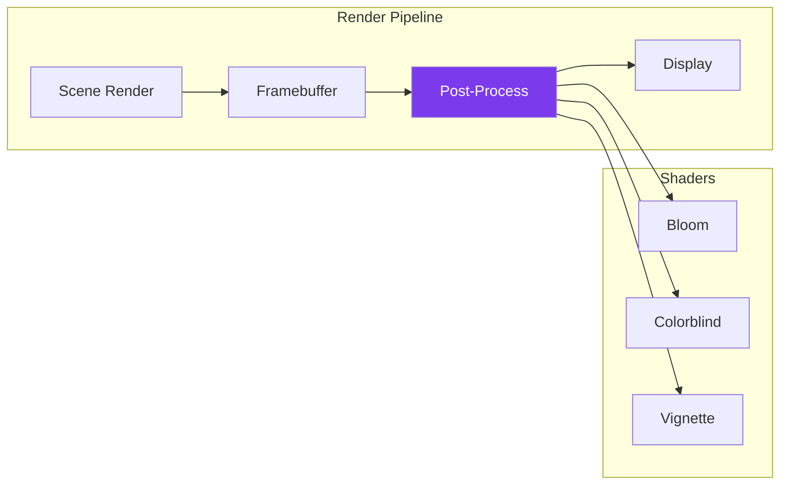
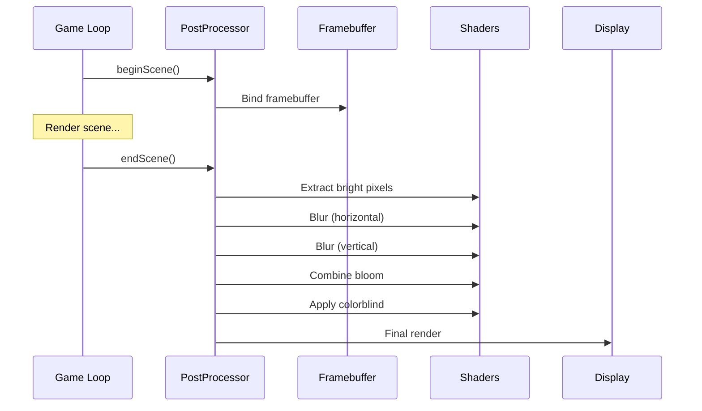

---
tags:
  - technique
  - graphiques
  - shaders
---

# Shaders et Post-Processing

Effets visuels et filtres d'accessibilité.

## Architecture



---

## Post-Processing Manager

```cpp
class PostProcessor {
    GLuint framebuffer_;
    GLuint colorTexture_;
    GLuint quadVAO_;

    std::vector<Shader*> effects_;
    bool colorblindEnabled_ = false;
    ColorblindMode colorblindMode_ = ColorblindMode::Normal;

public:
    void init(int width, int height) {
        // Create framebuffer
        glGenFramebuffers(1, &framebuffer_);
        glBindFramebuffer(GL_FRAMEBUFFER, framebuffer_);

        // Color attachment
        glGenTextures(1, &colorTexture_);
        glBindTexture(GL_TEXTURE_2D, colorTexture_);
        glTexImage2D(GL_TEXTURE_2D, 0, GL_RGB, width, height,
                     0, GL_RGB, GL_UNSIGNED_BYTE, nullptr);
        glFramebufferTexture2D(GL_FRAMEBUFFER, GL_COLOR_ATTACHMENT0,
                               GL_TEXTURE_2D, colorTexture_, 0);

        createQuad();
    }

    void beginScene() {
        glBindFramebuffer(GL_FRAMEBUFFER, framebuffer_);
        glClear(GL_COLOR_BUFFER_BIT);
    }

    void endScene() {
        glBindFramebuffer(GL_FRAMEBUFFER, 0);

        // Apply effects chain
        for (auto* effect : effects_) {
            applyEffect(effect);
        }

        // Final render to screen
        renderToScreen();
    }
};
```

---

## Filtres Daltonisme

### Modes Supportés

| Mode | Description | Prévalence |
|------|-------------|------------|
| `Protanopia` | Rouge absent | 1% hommes |
| `Deuteranopia` | Vert absent | 1% hommes |
| `Tritanopia` | Bleu absent | 0.01% |
| `Achromatopsia` | Noir/blanc | Rare |
| `HighContrast` | Contraste élevé | - |

### Shader Daltonisme

```glsl
#version 330 core

in vec2 TexCoords;
out vec4 FragColor;

uniform sampler2D screenTexture;
uniform int colorblindMode;

// Matrices de transformation
const mat3 PROTANOPIA = mat3(
    0.567, 0.433, 0.000,
    0.558, 0.442, 0.000,
    0.000, 0.242, 0.758
);

const mat3 DEUTERANOPIA = mat3(
    0.625, 0.375, 0.000,
    0.700, 0.300, 0.000,
    0.000, 0.300, 0.700
);

const mat3 TRITANOPIA = mat3(
    0.950, 0.050, 0.000,
    0.000, 0.433, 0.567,
    0.000, 0.475, 0.525
);

void main() {
    vec3 color = texture(screenTexture, TexCoords).rgb;

    switch (colorblindMode) {
        case 1: // Protanopia
            color = PROTANOPIA * color;
            break;
        case 2: // Deuteranopia
            color = DEUTERANOPIA * color;
            break;
        case 3: // Tritanopia
            color = TRITANOPIA * color;
            break;
        case 4: // Achromatopsia
            float gray = dot(color, vec3(0.299, 0.587, 0.114));
            color = vec3(gray);
            break;
        case 5: // High Contrast
            color = pow(color, vec3(0.7)) * 1.2;
            color = clamp(color, 0.0, 1.0);
            break;
    }

    FragColor = vec4(color, 1.0);
}
```

---

## Effets Visuels

### Bloom (Lueur)

```glsl
// bloom_extract.frag - Extraction des zones lumineuses
#version 330 core

in vec2 TexCoords;
out vec4 FragColor;

uniform sampler2D scene;
uniform float threshold;

void main() {
    vec3 color = texture(scene, TexCoords).rgb;
    float brightness = dot(color, vec3(0.2126, 0.7152, 0.0722));

    if (brightness > threshold) {
        FragColor = vec4(color, 1.0);
    } else {
        FragColor = vec4(0.0, 0.0, 0.0, 1.0);
    }
}

// bloom_blur.frag - Flou gaussien
#version 330 core

in vec2 TexCoords;
out vec4 FragColor;

uniform sampler2D image;
uniform bool horizontal;

const float weights[5] = float[](
    0.227027, 0.1945946, 0.1216216, 0.054054, 0.016216
);

void main() {
    vec2 texOffset = 1.0 / textureSize(image, 0);
    vec3 result = texture(image, TexCoords).rgb * weights[0];

    for (int i = 1; i < 5; i++) {
        vec2 offset = horizontal
            ? vec2(texOffset.x * i, 0.0)
            : vec2(0.0, texOffset.y * i);

        result += texture(image, TexCoords + offset).rgb * weights[i];
        result += texture(image, TexCoords - offset).rgb * weights[i];
    }

    FragColor = vec4(result, 1.0);
}
```

### Vignette

```glsl
#version 330 core

in vec2 TexCoords;
out vec4 FragColor;

uniform sampler2D scene;
uniform float intensity;
uniform float radius;

void main() {
    vec3 color = texture(scene, TexCoords).rgb;

    vec2 center = TexCoords - vec2(0.5);
    float dist = length(center);
    float vignette = smoothstep(radius, radius - 0.2, dist);

    color *= mix(1.0, vignette, intensity);

    FragColor = vec4(color, 1.0);
}
```

---

## Support par Backend

!!! warning "SFML uniquement"
    Les shaders post-processing ne sont supportés que par le backend **SFML**.
    Le backend SDL2 utilise une approche différente (voir ci-dessous).

### SFML : Shaders GLSL

```cpp
class SFMLWindow : public IWindow {
    sf::Shader _colorblindShader;
    sf::RenderTexture _renderTexture;
    std::string _activeShader;

public:
    bool loadShader(const std::string& key,
                    const std::string& vertPath,
                    const std::string& fragPath) override {
        return _shaders[key].loadFromFile(vertPath, fragPath);
    }

    void setPostProcessShader(const std::string& key) override {
        _activeShader = key;
    }

    void beginFrame() override {
        _renderTexture.clear();
        // Render to texture instead of window
    }

    void endFrame() override {
        // Apply shader and draw to window
        sf::Sprite sprite(_renderTexture.getTexture());
        _window.draw(sprite, &_shaders[_activeShader]);
    }

    bool supportsShaders() const override { return true; }
};
```

### SDL2 : Pas de Shaders

SDL2 **ne supporte pas les shaders** dans cette implémentation.

```cpp
class SDL2Window : public IWindow {
    bool loadShader(...) override { return false; }
    void setPostProcessShader(...) override { /* no-op */ }
    bool supportsShaders() const override { return false; }
};
```

Pour le mode daltonien, SDL2 utilise `AccessibilityConfig` qui fournit des **palettes de couleurs alternatives** au lieu de transformer l'image :

```cpp
// Le code de rendu utilise les couleurs de AccessibilityConfig
auto color = AccessibilityConfig::getInstance().getPlayerColor();
window.drawRect(x, y, w, h, {color.r, color.g, color.b, color.a});
```

Voir [Accessibilité](../../configuration/accessibilite.md) pour plus de détails.

---

## Configuration

```json
{
  "graphics": {
    "postProcessing": {
      "enabled": true,
      "bloom": {
        "enabled": true,
        "threshold": 0.8,
        "intensity": 1.0
      },
      "vignette": {
        "enabled": false,
        "intensity": 0.3,
        "radius": 0.8
      }
    },
    "accessibility": {
      "colorblindMode": "none"
    }
  }
}
```

---

## Pipeline Complet



---

## Paramètres

| Paramètre | Défaut | Description |
|-----------|--------|-------------|
| `bloom.threshold` | 0.8 | Seuil luminosité |
| `bloom.intensity` | 1.0 | Force du bloom |
| `vignette.intensity` | 0.3 | Assombrissement bords |
| `vignette.radius` | 0.8 | Rayon central |
