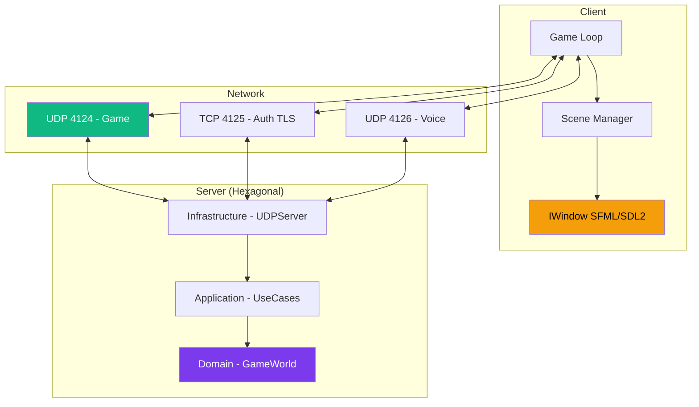

---
tags:
  - technique
  - architecture
---

# Documentation Technique

Plongez dans l'architecture et l'implémentation de R-Type.

<div class="grid-cards">
  <div class="card">
    <div class="card-icon">🏗️</div>
    <h3><a href="architecture/">Architecture</a></h3>
    <p>Vision globale du système et design patterns.</p>
  </div>

  <div class="card card-highlight">
    <div class="card-icon">🎨</div>
    <h3><a href="graphiques/">Système Graphique</a></h3>
    <p>Architecture multi-backend SDL2/SFML.</p>
  </div>

  <div class="card">
    <div class="card-icon">🌐</div>
    <h3><a href="reseau/">Réseau</a></h3>
    <p>Protocole UDP et synchronisation.</p>
  </div>

  <div class="card">
    <div class="card-icon">📚</div>
    <h3><a href="api/">API Reference</a></h3>
    <p>Documentation des interfaces publiques.</p>
  </div>
</div>

---

## Vue d'Ensemble

R-Type est conçu avec une **architecture hexagonale** (ports & adapters) permettant une séparation claire entre :

- **Domaine** : Logique de jeu pure
- **Infrastructure** : Implémentations concrètes (réseau, graphiques)
- **Application** : Orchestration des cas d'usage



---

## Technologies

| Composant | Technologie | Raison |
|-----------|-------------|--------|
| **Langage** | C++23 | Performance, modernité |
| **Build** | CMake 3.30+, Ninja, vcpkg | Standard industrie |
| **Réseau** | Boost.ASIO | Asynchrone, cross-platform |
| **Sécurité** | OpenSSL (TLS 1.2+) | Auth TCP sécurisée |
| **Graphiques** | SDL2 / SFML | Multi-backend (statique) |
| **Audio** | PortAudio, Opus | Voice chat temps réel |

---

## Patterns Utilisés

### Architecture Hexagonale (Serveur)

Le serveur utilise Ports & Adapters pour isoler le domaine :

```cpp
// Domain (logique pure)
namespace domain {
    class Player { /* Position, Health, etc. */ };
    class GameRule { /* Collision, Score, etc. */ };
}

// Ports (interfaces)
namespace application::ports {
    class IUserRepository { /* Persist users */ };
    class ILogger { /* Logging */ };
}

// Adapters (implémentations)
namespace infrastructure::adapters {
    class MongoUserRepository : IUserRepository { };
    class UDPServer { /* Réseau UDP */ };
}
```

### Plugin Architecture (Graphics)

Les backends graphiques sont chargés **dynamiquement** via `dlopen`/`LoadLibrary` :

```cpp
// Interface plugin
class IGraphicPlugin {
public:
    virtual const char* getName() const = 0;
    virtual std::shared_ptr<IWindow> createWindow(Vec2u size, const std::string& name) = 0;
};

// Chargement dynamique cross-platform (DynamicLib.cpp)
#ifdef _WIN32
    _handle = LoadLibraryA("librtype_sfml.dll");
    _create_lib = (create_t)GetProcAddress(_handle, "create");
#else
    _handle = dlopen("librtype_sfml.so", RTLD_LAZY);
    _create_lib = (create_t)dlsym(_handle, "create");
#endif
```

---

## Structure du Code

```
src/
├── client/
│   ├── main.cpp
│   ├── include/
│   │   ├── scenes/        # IScene, GameScene, MenuScene
│   │   ├── graphics/      # IWindow, IDrawable
│   │   ├── network/       # TCPClient, UDPClient
│   │   ├── audio/         # VoiceChatManager, OpusCodec
│   │   └── events/        # Event system (KeyPressed, etc.)
│   ├── src/               # Implémentations
│   └── lib/               # Backends graphiques
│       ├── sfml/          # SFMLWindow
│       └── sdl2/          # SDL2Window
├── server/
│   ├── main.cpp
│   ├── include/
│   │   ├── domain/        # Entités, Value Objects
│   │   ├── application/   # Use Cases, Ports
│   │   └── infrastructure/# Adapters réseau
│   └── infrastructure/
│       ├── adapters/in/network/  # UDPServer, TCPAuthServer
│       └── game/          # GameWorld
├── common/
│   ├── protocol/          # Protocol.hpp (sérialisation)
│   └── collision/         # AABB.hpp (hitboxes)
└── tests/
```

---

## Performances

### Objectifs

| Métrique | Cible |
|----------|-------|
| FPS Client | 60+ stable |
| Broadcast Serveur | 20 Hz (50ms) |
| Latence Réseau | < 50ms |
| Timeout Joueur | 2000ms |

### Optimisations

- **Client-Side Prediction** : Mouvement fluide malgré la latence
- **Full State Snapshots** : Robuste à la perte de paquets
- **UDP Game / TCP Auth** : Latence minimale pour le jeu
- **Opus VoIP** : Audio compressé 32kbps
