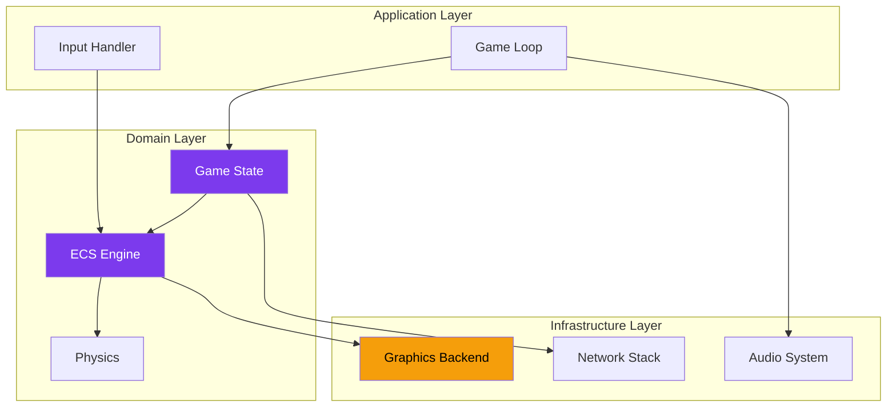

---
tags:
  - technique
  - architecture
---

# Documentation Technique

Plongez dans l'architecture et l'implémentation de R-Type.

<div class="grid-cards">
  <div class="card">
    <div class="card-icon">🏗️</div>
    <h3><a href="architecture/">Architecture</a></h3>
    <p>Vision globale du système et design patterns.</p>
  </div>

  <div class="card card-highlight">
    <div class="card-icon">🎨</div>
    <h3><a href="graphiques/">Système Graphique</a></h3>
    <p>Architecture multi-backend SDL2/SFML.</p>
  </div>

  <div class="card">
    <div class="card-icon">🌐</div>
    <h3><a href="reseau/">Réseau</a></h3>
    <p>Protocole UDP et synchronisation.</p>
  </div>

  <div class="card">
    <div class="card-icon">📚</div>
    <h3><a href="api/">API Reference</a></h3>
    <p>Documentation des interfaces publiques.</p>
  </div>
</div>

---

## Vue d'Ensemble

R-Type est conçu avec une **architecture hexagonale** (ports & adapters) permettant une séparation claire entre :

- **Domaine** : Logique de jeu pure
- **Infrastructure** : Implémentations concrètes (réseau, graphiques)
- **Application** : Orchestration des cas d'usage



---

## Technologies

| Composant | Technologie | Raison |
|-----------|-------------|--------|
| **Langage** | C++23 | Performance, modernité |
| **Build** | CMake 3.20+ | Standard industrie |
| **Réseau** | Boost.ASIO | Asynchrone, cross-platform |
| **Logging** | spdlog | Rapide, formaté |
| **Config** | nlohmann/json | Parsing JSON moderne |
| **Graphiques** | SDL2 / SFML | Flexibilité multi-backend |

---

## Patterns Utilisés

### Entity Component System (ECS)

Le cœur du moteur de jeu utilise un ECS pour maximiser les performances :

```cpp
// Entité = ID unique
using Entity = std::uint64_t;

// Composant = données pures
struct Position { float x, y; };
struct Velocity { float dx, dy; };
struct Sprite { TextureId texture; };

// Système = logique
class MovementSystem {
    void update(Registry& reg, float dt) {
        for (auto [entity, pos, vel] : reg.view<Position, Velocity>()) {
            pos.x += vel.dx * dt;
            pos.y += vel.dy * dt;
        }
    }
};
```

### Plugin Architecture

Les backends graphiques sont chargés dynamiquement :

```cpp
// Interface abstraite
class IGraphicsBackend {
public:
    virtual void render(const RenderQueue&) = 0;
    virtual void present() = 0;
};

// Chargement dynamique
auto backend = PluginLoader::load<IGraphicsBackend>("sdl2");
```

---

## Structure du Code

```
src/
├── client/
│   ├── main.cpp
│   ├── graphics/          # Système graphique
│   │   ├── IBackend.hpp   # Interface abstraite
│   │   ├── sdl2/          # Implémentation SDL2
│   │   └── sfml/          # Implémentation SFML
│   └── input/
├── server/
│   ├── main.cpp
│   ├── network/           # Couche réseau
│   └── game/
├── common/
│   ├── ecs/               # Entity Component System
│   ├── protocol/          # Sérialisation réseau
│   └── utils/
└── tests/
```

---

## Performances

### Objectifs

| Métrique | Cible |
|----------|-------|
| FPS Client | 60+ stable |
| Tick Rate Serveur | 60 Hz |
| Latence Réseau | < 50ms |
| Mémoire Client | < 256 MB |

### Optimisations

- **Data-Oriented Design** : Cache-friendly ECS
- **Object Pooling** : Réutilisation des entités
- **Batch Rendering** : Minimisation des draw calls
- **UDP** : Latence minimale réseau
