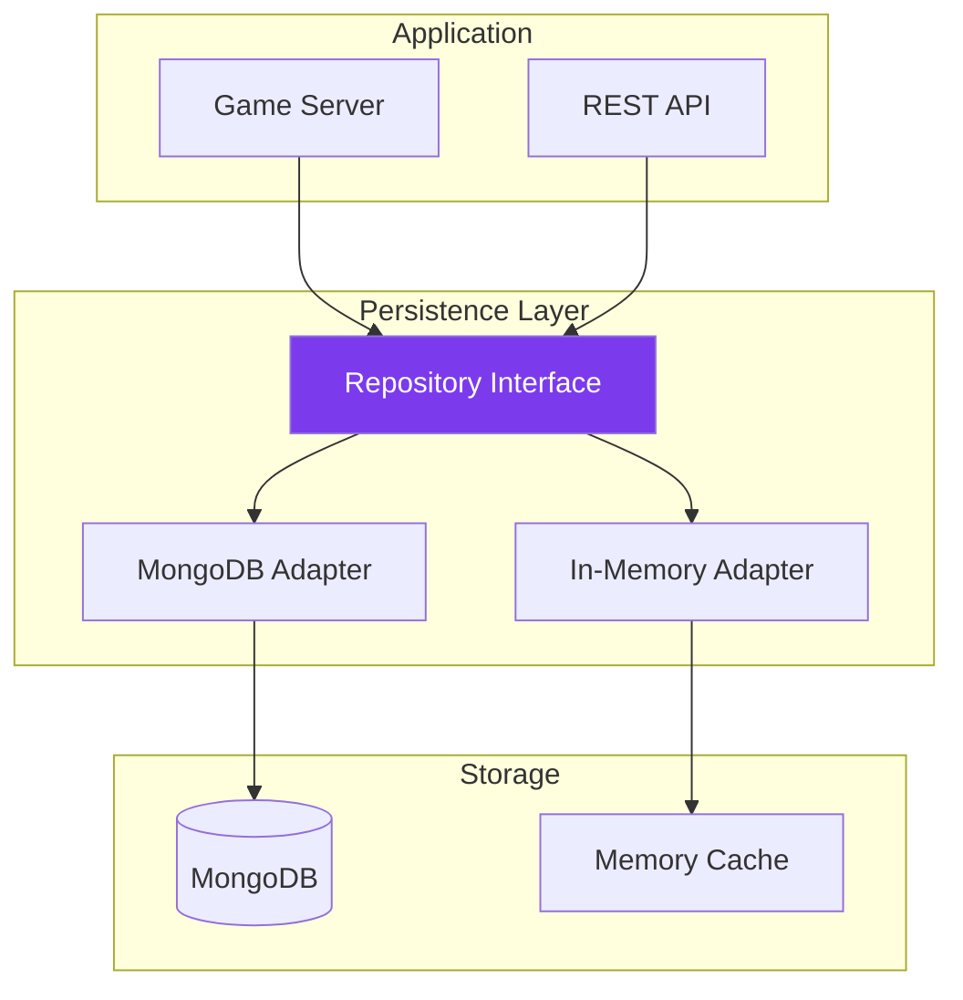
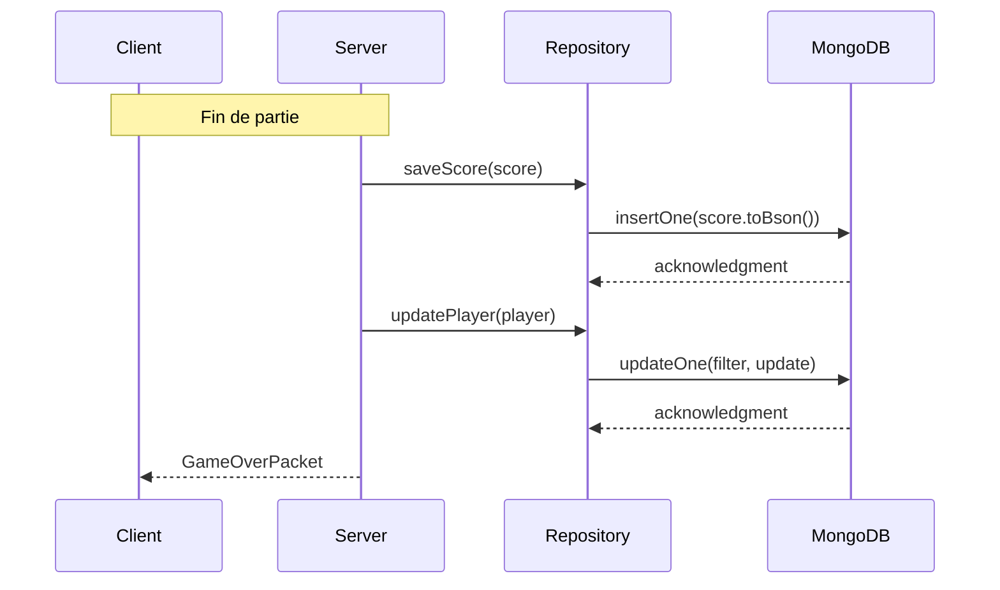

---
tags:
  - technique
  - persistance
  - database
---

# Système de Persistance

Sauvegarde et chargement des données de jeu.

## Architecture



---

## Données Persistées

| Donnée | Collection | Description |
|--------|------------|-------------|
| Joueurs | `players` | Profils, statistiques |
| Scores | `highscores` | Meilleurs scores |
| Sessions | `sessions` | Parties en cours |
| Config | `config` | Configuration serveur |

---

## Repository Pattern

Interface abstraite pour la persistance.

```cpp
// Port (Interface)
template<typename T>
class IRepository {
public:
    virtual ~IRepository() = default;

    virtual std::optional<T> findById(const std::string& id) = 0;
    virtual std::vector<T> findAll() = 0;
    virtual void save(const T& entity) = 0;
    virtual void update(const T& entity) = 0;
    virtual void remove(const std::string& id) = 0;
};

// Spécialisations
class IPlayerRepository : public IRepository<Player> {
public:
    virtual std::optional<Player> findByUsername(
        const std::string& username) = 0;
    virtual std::vector<Player> findTopPlayers(int limit) = 0;
};

class IScoreRepository : public IRepository<Score> {
public:
    virtual std::vector<Score> getLeaderboard(int limit) = 0;
    virtual std::vector<Score> getPlayerScores(
        const std::string& playerId) = 0;
};
```

---

## Modèles de Données

### Player

```cpp
struct Player {
    std::string id;
    std::string username;
    std::string passwordHash;
    int totalScore = 0;
    int gamesPlayed = 0;
    int highScore = 0;
    std::chrono::system_clock::time_point createdAt;
    std::chrono::system_clock::time_point lastLogin;

    // Sérialisation BSON
    bsoncxx::document::value toBson() const {
        using bsoncxx::builder::basic::kvp;
        using bsoncxx::builder::basic::make_document;

        return make_document(
            kvp("_id", bsoncxx::oid{id}),
            kvp("username", username),
            kvp("passwordHash", passwordHash),
            kvp("totalScore", totalScore),
            kvp("gamesPlayed", gamesPlayed),
            kvp("highScore", highScore),
            kvp("createdAt", bsoncxx::types::b_date{createdAt}),
            kvp("lastLogin", bsoncxx::types::b_date{lastLogin})
        );
    }

    static Player fromBson(const bsoncxx::document::view& doc) {
        Player p;
        p.id = doc["_id"].get_oid().value.to_string();
        p.username = std::string(doc["username"].get_string().value);
        p.passwordHash = std::string(doc["passwordHash"].get_string().value);
        p.totalScore = doc["totalScore"].get_int32().value;
        p.gamesPlayed = doc["gamesPlayed"].get_int32().value;
        p.highScore = doc["highScore"].get_int32().value;
        return p;
    }
};
```

### Score

```cpp
struct Score {
    std::string id;
    std::string playerId;
    std::string playerName;
    int score;
    int wave;
    int enemiesKilled;
    std::chrono::milliseconds duration;
    std::chrono::system_clock::time_point timestamp;

    bsoncxx::document::value toBson() const;
    static Score fromBson(const bsoncxx::document::view& doc);
};
```

---

## Flux de Données



---

## Documentation

<div class="grid-cards">
  <div class="card">
    <h3><a href="mongodb/">🍃 MongoDB</a></h3>
    <p>Implémentation MongoDB</p>
  </div>
</div>
