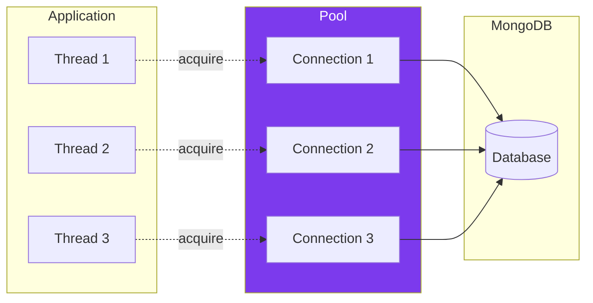

---
tags:
  - technique
  - persistance
  - mongodb
---

# MongoDB

Implémentation de la persistance avec MongoDB.

## Configuration

### Variables d'Environnement

```bash
# .env
MONGO_URI=mongodb://localhost:27017
MONGO_DATABASE=rtype
MONGO_POOL_SIZE=10
```

### Structure Base de Données

```
rtype/
├── players        # Profils joueurs
├── highscores     # Meilleurs scores
├── sessions       # Parties actives
└── config         # Configuration
```

---

## MongoDB Adapter

```cpp
#include <mongocxx/client.hpp>
#include <mongocxx/pool.hpp>

class MongoDBAdapter {
    std::unique_ptr<mongocxx::pool> pool_;
    std::string database_;

public:
    MongoDBAdapter(const std::string& uri, const std::string& database)
        : database_(database)
    {
        mongocxx::uri mongoUri{uri};
        pool_ = std::make_unique<mongocxx::pool>(mongoUri);
    }

    auto getClient() {
        return pool_->acquire();
    }

    auto getCollection(const std::string& name) {
        auto client = getClient();
        return (*client)[database_][name];
    }
};
```

---

## Player Repository

```cpp
class MongoPlayerRepository : public IPlayerRepository {
    MongoDBAdapter& db_;

public:
    explicit MongoPlayerRepository(MongoDBAdapter& db) : db_(db) {}

    std::optional<Player> findById(const std::string& id) override {
        auto collection = db_.getCollection("players");

        auto result = collection.find_one(
            bsoncxx::builder::basic::make_document(
                bsoncxx::builder::basic::kvp("_id", bsoncxx::oid{id})
            )
        );

        if (result) {
            return Player::fromBson(result->view());
        }
        return std::nullopt;
    }

    std::optional<Player> findByUsername(
        const std::string& username) override
    {
        auto collection = db_.getCollection("players");

        auto result = collection.find_one(
            bsoncxx::builder::basic::make_document(
                bsoncxx::builder::basic::kvp("username", username)
            )
        );

        if (result) {
            return Player::fromBson(result->view());
        }
        return std::nullopt;
    }

    std::vector<Player> findAll() override {
        auto collection = db_.getCollection("players");
        std::vector<Player> players;

        for (auto&& doc : collection.find({})) {
            players.push_back(Player::fromBson(doc));
        }
        return players;
    }

    void save(const Player& player) override {
        auto collection = db_.getCollection("players");
        collection.insert_one(player.toBson());
    }

    void update(const Player& player) override {
        auto collection = db_.getCollection("players");

        collection.replace_one(
            bsoncxx::builder::basic::make_document(
                bsoncxx::builder::basic::kvp("_id", bsoncxx::oid{player.id})
            ),
            player.toBson()
        );
    }

    void remove(const std::string& id) override {
        auto collection = db_.getCollection("players");

        collection.delete_one(
            bsoncxx::builder::basic::make_document(
                bsoncxx::builder::basic::kvp("_id", bsoncxx::oid{id})
            )
        );
    }

    std::vector<Player> findTopPlayers(int limit) override {
        using namespace bsoncxx::builder::basic;

        auto collection = db_.getCollection("players");
        std::vector<Player> players;

        mongocxx::options::find opts;
        opts.sort(make_document(kvp("highScore", -1)));
        opts.limit(limit);

        for (auto&& doc : collection.find({}, opts)) {
            players.push_back(Player::fromBson(doc));
        }
        return players;
    }
};
```

---

## Score Repository

```cpp
class MongoScoreRepository : public IScoreRepository {
    MongoDBAdapter& db_;

public:
    explicit MongoScoreRepository(MongoDBAdapter& db) : db_(db) {}

    std::vector<Score> getLeaderboard(int limit) override {
        using namespace bsoncxx::builder::basic;

        auto collection = db_.getCollection("highscores");
        std::vector<Score> scores;

        mongocxx::options::find opts;
        opts.sort(make_document(kvp("score", -1)));
        opts.limit(limit);

        for (auto&& doc : collection.find({}, opts)) {
            scores.push_back(Score::fromBson(doc));
        }
        return scores;
    }

    std::vector<Score> getPlayerScores(const std::string& playerId) override {
        using namespace bsoncxx::builder::basic;

        auto collection = db_.getCollection("highscores");
        std::vector<Score> scores;

        mongocxx::options::find opts;
        opts.sort(make_document(kvp("timestamp", -1)));
        opts.limit(10);

        auto filter = make_document(kvp("playerId", playerId));

        for (auto&& doc : collection.find(filter.view(), opts)) {
            scores.push_back(Score::fromBson(doc));
        }
        return scores;
    }

    void save(const Score& score) override {
        auto collection = db_.getCollection("highscores");
        collection.insert_one(score.toBson());
    }

    // ... autres méthodes
};
```

---

## Index MongoDB

```javascript
// Création des index pour performances
db.players.createIndex({ "username": 1 }, { unique: true });
db.players.createIndex({ "highScore": -1 });

db.highscores.createIndex({ "score": -1 });
db.highscores.createIndex({ "playerId": 1, "timestamp": -1 });

db.sessions.createIndex({ "expiresAt": 1 }, { expireAfterSeconds: 0 });
```

---

## Connection Pooling



---

## In-Memory Fallback

Pour les tests ou mode hors-ligne.

```cpp
class InMemoryPlayerRepository : public IPlayerRepository {
    std::unordered_map<std::string, Player> players_;
    mutable std::mutex mutex_;

public:
    std::optional<Player> findById(const std::string& id) override {
        std::lock_guard lock(mutex_);
        auto it = players_.find(id);
        if (it != players_.end()) {
            return it->second;
        }
        return std::nullopt;
    }

    std::optional<Player> findByUsername(
        const std::string& username) override
    {
        std::lock_guard lock(mutex_);
        for (const auto& [id, player] : players_) {
            if (player.username == username) {
                return player;
            }
        }
        return std::nullopt;
    }

    void save(const Player& player) override {
        std::lock_guard lock(mutex_);
        players_[player.id] = player;
    }

    // ... autres méthodes
};
```

---

## Factory Pattern

```cpp
class RepositoryFactory {
public:
    enum class Type { MongoDB, InMemory };

    static std::unique_ptr<IPlayerRepository> createPlayerRepository(
        Type type,
        MongoDBAdapter* db = nullptr)
    {
        switch (type) {
            case Type::MongoDB:
                if (!db) throw std::runtime_error("MongoDB adapter required");
                return std::make_unique<MongoPlayerRepository>(*db);

            case Type::InMemory:
                return std::make_unique<InMemoryPlayerRepository>();
        }
        throw std::runtime_error("Unknown repository type");
    }
};

// Usage
auto repo = RepositoryFactory::createPlayerRepository(
    RepositoryFactory::Type::MongoDB,
    &mongoAdapter
);
```

---

## Configuration CMake

```cmake
# MongoDB C++ Driver
find_package(mongocxx REQUIRED)
find_package(bsoncxx REQUIRED)

target_link_libraries(rtype_server
    PRIVATE
        mongo::mongocxx_shared
        mongo::bsoncxx_shared
)
```

---

## Schéma Documents

### Player Document

```json
{
  "_id": ObjectId("..."),
  "username": "player1",
  "passwordHash": "$argon2id$...",
  "totalScore": 15000,
  "gamesPlayed": 25,
  "highScore": 3500,
  "createdAt": ISODate("2024-01-15T10:30:00Z"),
  "lastLogin": ISODate("2024-01-20T15:45:00Z")
}
```

### Score Document

```json
{
  "_id": ObjectId("..."),
  "playerId": "...",
  "playerName": "player1",
  "score": 3500,
  "wave": 5,
  "enemiesKilled": 47,
  "duration": 180000,
  "timestamp": ISODate("2024-01-20T15:50:00Z")
}
```
