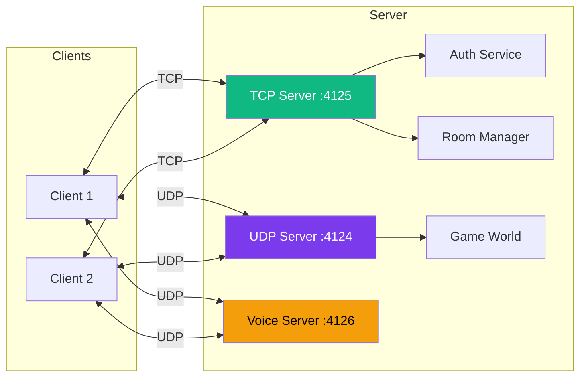
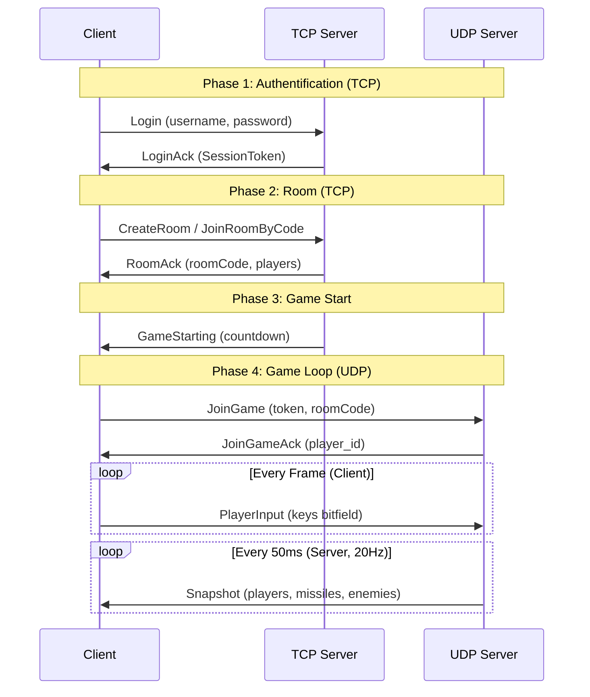

---
tags:
  - technique
  - réseau
---

# Système Réseau

Architecture réseau client-serveur utilisant UDP et TCP.

## Vue d'Ensemble

R-Type utilise un modèle **client-serveur autoritatif** avec deux protocoles :

- **TCP (port 4125)** : Authentification, gestion des rooms, chat
- **UDP (port 4124)** : Synchronisation de jeu temps réel
- **UDP (port 4126)** : Voice chat (Opus codec)



---

## Protocole TCP (Authentification & Rooms)

### Header TCP

Tous les messages TCP commencent par un header de 7 bytes :

```cpp
struct Header {
    uint8_t  isAuthenticated;  // 1 byte
    uint16_t type;             // 2 bytes (network order)
    uint32_t payload_size;     // 4 bytes (network order)
};
```

### Types de Messages TCP

| Type | Value | Direction | Description |
|------|-------|-----------|-------------|
| `Login` | 0x0100 | C→S | Connexion utilisateur |
| `LoginAck` | 0x0101 | S→C | Réponse login + SessionToken |
| `Register` | 0x0102 | C→S | Création de compte |
| `RegisterAck` | 0x0103 | S→C | Réponse inscription |
| `CreateRoom` | 0x0200 | C→S | Créer une room |
| `CreateRoomAck` | 0x0201 | S→C | Room créée + code |
| `JoinRoomByCode` | 0x0210 | C→S | Rejoindre par code |
| `JoinRoomAck` | 0x0211 | S→C | Accès accordé |
| `JoinRoomNack` | 0x0212 | S→C | Accès refusé |
| `LeaveRoom` | 0x0220 | C→S | Quitter room |
| `SetReady` | 0x0230 | C→S | Prêt à jouer |
| `StartGame` | 0x0240 | C→S | Lancer la partie (host) |
| `RoomUpdate` | 0x0250 | S→C | État room (broadcast) |
| `GameStarting` | 0x0251 | S→C | Countdown démarrage |

### Structures TCP Clés

```cpp
// Session token (32 bytes) - Pour authentifier UDP
struct SessionToken {
    uint8_t bytes[32];
};

// LoginMessage
struct LoginMessage {
    char username[32];
    char password[64];
};

// AuthResponseWithToken (succès login)
struct AuthResponseWithToken {
    bool success;
    char error_code[32];
    char message[128];
    SessionToken token;  // Pour auth UDP
};

// RoomPlayerState (état d'un joueur dans le lobby)
struct RoomPlayerState {
    uint8_t slotId;
    uint8_t occupied;
    char displayName[32];
    char email[255];
    uint8_t isReady;
    uint8_t isHost;
    uint8_t shipSkin;  // 1-6
};
```

---

## Protocole UDP (Game)

### Header UDP

Tous les messages UDP commencent par un header de 12 bytes :

```cpp
struct UDPHeader {
    uint16_t type;          // 2 bytes (network order)
    uint16_t sequence_num;  // 2 bytes (network order)
    uint64_t timestamp;     // 8 bytes (milliseconds since epoch)
};
```

### Types de Messages UDP

| Type | Value | Direction | Description |
|------|-------|-----------|-------------|
| `HeartBeat` | 0x0001 | Both | Keep-alive |
| `HeartBeatAck` | 0x0002 | S→C | Réponse heartbeat |
| `JoinGame` | 0x0010 | C→S | Authentification UDP (token) |
| `JoinGameAck` | 0x0011 | S→C | player_id assigné |
| `JoinGameNack` | 0x0012 | S→C | Rejet (token invalide) |
| `Snapshot` | 0x0040 | S→C | État complet du jeu (20Hz) |
| `PlayerInput` | 0x0061 | C→S | Inputs du joueur |
| `PlayerJoin` | 0x0070 | S→C | Nouveau joueur |
| `PlayerLeave` | 0x0071 | S→C | Joueur déconnecté |
| `ShootMissile` | 0x0080 | C→S | Demande de tir |
| `MissileSpawned` | 0x0081 | S→C | Missile créé |
| `MissileDestroyed` | 0x0082 | S→C | Missile détruit |
| `EnemyDestroyed` | 0x0091 | S→C | Ennemi détruit |
| `PlayerDamaged` | 0x00A0 | S→C | Joueur touché |
| `PlayerDied` | 0x00A1 | S→C | Joueur mort |

### Structures UDP Clés

#### JoinGame (authentification UDP)

```cpp
struct JoinGame {
    SessionToken token;      // 32 bytes - Token du login TCP
    uint8_t shipSkin;        // 1 byte - Skin vaisseau (1-6)
    char roomCode[6];        // 6 bytes - Code de la room
    // Total: 39 bytes
};
```

#### PlayerInput (envoi des touches)

**IMPORTANT** : Le client envoie les **touches pressées**, pas la position !

```cpp
struct PlayerInput {
    uint16_t keys;         // Bitfield des touches
    uint16_t sequenceNum;  // Pour réconciliation client-side
    // Total: 4 bytes
};

// Bitfield des touches
namespace InputKeys {
    constexpr uint16_t UP    = 0x0001;
    constexpr uint16_t DOWN  = 0x0002;
    constexpr uint16_t LEFT  = 0x0004;
    constexpr uint16_t RIGHT = 0x0008;
    constexpr uint16_t SHOOT = 0x0010;
}
```

#### PlayerState (dans Snapshot)

```cpp
struct PlayerState {
    uint8_t  id;
    uint16_t x;
    uint16_t y;
    uint8_t  health;
    uint8_t  alive;
    uint16_t lastAckedInputSeq;  // Pour réconciliation
    uint8_t  shipSkin;
    // Total: 10 bytes
};
```

#### GameSnapshot (broadcast 20Hz)

```cpp
struct GameSnapshot {
    uint8_t player_count;
    PlayerState players[4];      // MAX_PLAYERS = 4
    uint8_t missile_count;
    MissileState missiles[32];   // MAX_MISSILES = 32
    uint8_t enemy_count;
    EnemyState enemies[16];      // MAX_ENEMIES = 16
    uint8_t enemy_missile_count;
    MissileState enemy_missiles[32];
};
```

---

## Voice Chat (UDP port 4126)

### Types de Messages Voice

| Type | Value | Direction | Description |
|------|-------|-----------|-------------|
| `VoiceJoin` | 0x0300 | C→S | Rejoindre voice channel |
| `VoiceJoinAck` | 0x0301 | S→C | Confirmation |
| `VoiceLeave` | 0x0302 | C→S | Quitter voice |
| `VoiceFrame` | 0x0303 | Both | Audio Opus encodé |
| `VoiceMute` | 0x0304 | Both | Mute/unmute |

### Structure VoiceFrame

```cpp
struct VoiceFrame {
    uint8_t  speaker_id;    // 1 byte - Qui parle
    uint16_t sequence;      // 2 bytes - Détection perte paquets
    uint16_t opus_len;      // 2 bytes - Taille données Opus
    uint8_t  opus_data[480]; // Max 480 bytes Opus
    // Header: 5 bytes, Total max: 485 bytes
};
```

---

## Sérialisation

Toutes les structures utilisent **network byte order** (big-endian) :

```cpp
// Conversion host → network
inline uint16_t swap16(uint16_t v) { return __builtin_bswap16(v); }
inline uint32_t swap32(uint32_t v) { return __builtin_bswap32(v); }
inline uint64_t swap64(uint64_t v) { return __builtin_bswap64(v); }

// Pattern standard
void to_bytes(uint8_t* buf) const {
    uint16_t net_x = swap16(x);
    std::memcpy(buf, &net_x, 2);
}

static std::optional<T> from_bytes(const void* buf, size_t len) {
    if (len < WIRE_SIZE) return std::nullopt;
    uint16_t net_x;
    std::memcpy(&net_x, buf, 2);
    return T{.x = swap16(net_x)};
}
```

---

## Diagramme de Séquence



---

## Constantes

| Constante | Valeur | Description |
|-----------|--------|-------------|
| `MAX_PLAYERS` | 4 | Joueurs max par partie |
| `MAX_MISSILES` | 32 | Missiles joueurs max |
| `MAX_ENEMIES` | 16 | Ennemis max |
| `MAX_ENEMY_MISSILES` | 32 | Missiles ennemis max |
| `MAX_ROOM_PLAYERS` | 6 | Joueurs max par room |
| `TOKEN_SIZE` | 32 | Taille SessionToken (bytes) |
| `BROADCAST_RATE` | 20Hz | Fréquence snapshots |
| `VOICE_UDP_PORT` | 4126 | Port voice chat |
| `MAX_OPUS_FRAME_SIZE` | 480 | Taille max frame Opus |

---

## Documentation Détaillée

- [TCP Protocol](tcp.md) - Authentification et rooms
- [UDP Protocol](udp.md) - Synchronisation jeu avec client-side prediction
- [Voice Protocol](voice.md) - Audio temps réel avec Opus
- [Structures Binaires](structures.md) - Référence complète des formats
