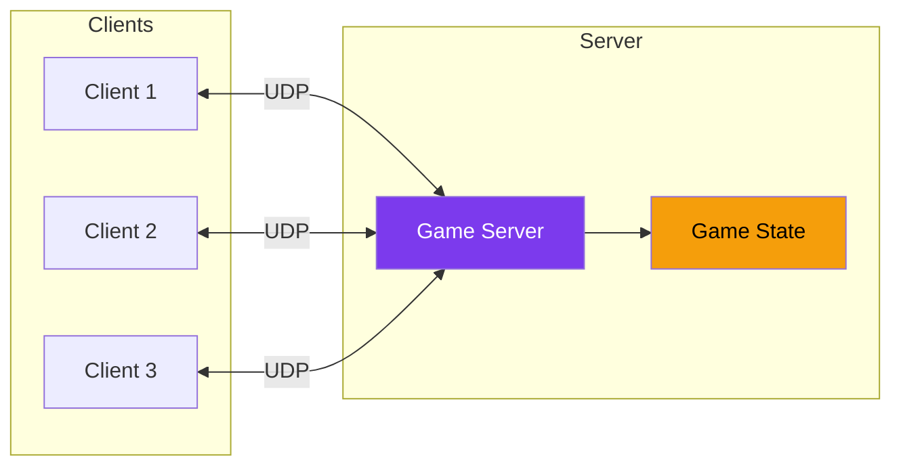
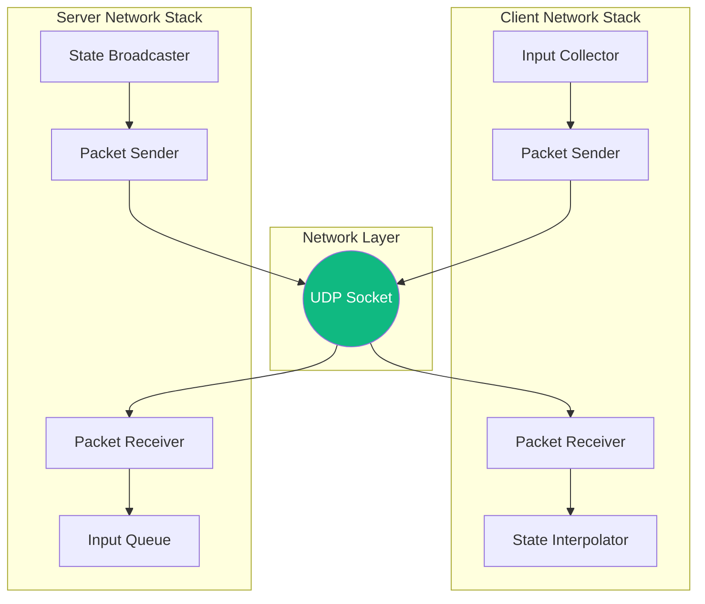
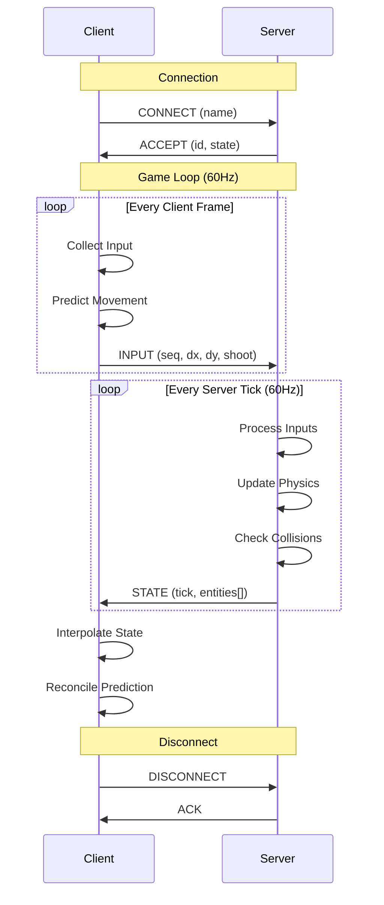

---
tags:
  - technique
  - réseau
---

# Système Réseau

Architecture réseau client-serveur utilisant UDP pour une latence minimale.

## Vue d'Ensemble

R-Type utilise un modèle **client-serveur autoritatif** où le serveur est la source de vérité pour l'état du jeu.



---

## Pourquoi UDP ?

| Aspect | UDP | TCP |
|--------|-----|-----|
| **Latence** | ⭐⭐⭐⭐⭐ | ⭐⭐⭐ |
| **Fiabilité** | ❌ (géré manuellement) | ✅ (garanti) |
| **Ordre** | ❌ (non garanti) | ✅ (garanti) |
| **Overhead** | Minimal | Headers + ACKs |

Pour un jeu d'action en temps réel, la **latence est critique**. UDP permet :

- Envoi immédiat sans attente d'ACK
- Tolérance à la perte de paquets (état suivant remplace le précédent)
- Contrôle fin sur la fiabilité quand nécessaire

---

## Architecture



---

## Protocole de Communication

### Types de Paquets

| ID | Type | Direction | Description |
|----|------|-----------|-------------|
| `0x01` | `CONNECT` | C→S | Demande de connexion |
| `0x02` | `ACCEPT` | S→C | Connexion acceptée |
| `0x03` | `REJECT` | S→C | Connexion refusée |
| `0x04` | `DISCONNECT` | C↔S | Déconnexion |
| `0x10` | `INPUT` | C→S | Inputs du joueur |
| `0x20` | `STATE` | S→C | État du monde |
| `0x21` | `DELTA` | S→C | Delta state |
| `0x30` | `EVENT` | S→C | Événement de jeu |
| `0x40` | `PING` | C↔S | Mesure latence |
| `0x41` | `PONG` | C↔S | Réponse ping |

### Format des Paquets

```
+--------+--------+--------+--------+--------+
| Magic  | Type   | Seq#   | Size   | Data   |
| 2B     | 1B     | 4B     | 2B     | ...    |
+--------+--------+--------+--------+--------+
```

```cpp
struct PacketHeader {
    uint16_t magic = 0x5254;  // "RT" for R-Type
    uint8_t type;
    uint32_t sequence;
    uint16_t dataSize;
};
```

---

## Implémentation Boost.ASIO

### UDPSocket Wrapper

```cpp
#include <boost/asio.hpp>

namespace rtype::network {

using boost::asio::ip::udp;

class UDPSocket {
public:
    UDPSocket(boost::asio::io_context& io)
        : socket_(io, udp::endpoint(udp::v4(), 0))
    {}

    void bind(uint16_t port) {
        socket_.bind(udp::endpoint(udp::v4(), port));
    }

    void sendTo(const Packet& packet, const udp::endpoint& dest) {
        auto buffer = packet.serialize();
        socket_.send_to(boost::asio::buffer(buffer), dest);
    }

    void asyncReceive() {
        socket_.async_receive_from(
            boost::asio::buffer(receiveBuffer_),
            senderEndpoint_,
            [this](auto ec, auto bytes) {
                if (!ec) {
                    handleReceive(bytes);
                }
                asyncReceive();
            }
        );
    }

private:
    void handleReceive(std::size_t bytes);

    udp::socket socket_;
    udp::endpoint senderEndpoint_;
    std::array<uint8_t, 1024> receiveBuffer_;
};

} // namespace rtype::network
```

### Client Network

```cpp
class NetworkClient {
public:
    void connect(const std::string& host, uint16_t port) {
        serverEndpoint_ = *resolver_.resolve(host, std::to_string(port));

        // Send connect packet
        Packet connectPacket(PacketType::CONNECT);
        connectPacket.write(playerName_);
        socket_.sendTo(connectPacket, serverEndpoint_);

        // Start receiving
        socket_.asyncReceive();
        ioThread_ = std::thread([this] { io_.run(); });
    }

    void sendInput(const PlayerInput& input) {
        Packet packet(PacketType::INPUT);
        packet.write(input.sequence);
        packet.write(input.moveX);
        packet.write(input.moveY);
        packet.write(input.shooting);
        socket_.sendTo(packet, serverEndpoint_);
    }

private:
    boost::asio::io_context io_;
    UDPSocket socket_{io_};
    udp::endpoint serverEndpoint_;
    std::thread ioThread_;
};
```

---

## Sérialisation

### Packet Class

```cpp
class Packet {
public:
    explicit Packet(PacketType type)
        : header_{.type = static_cast<uint8_t>(type)}
    {}

    template<typename T>
    void write(const T& value) {
        static_assert(std::is_trivially_copyable_v<T>);
        auto ptr = reinterpret_cast<const uint8_t*>(&value);
        data_.insert(data_.end(), ptr, ptr + sizeof(T));
    }

    void write(const std::string& str) {
        write(static_cast<uint16_t>(str.size()));
        data_.insert(data_.end(), str.begin(), str.end());
    }

    template<typename T>
    T read() {
        static_assert(std::is_trivially_copyable_v<T>);
        T value;
        std::memcpy(&value, &data_[readPos_], sizeof(T));
        readPos_ += sizeof(T);
        return value;
    }

    std::vector<uint8_t> serialize() const {
        std::vector<uint8_t> buffer;
        // Write header
        auto headerPtr = reinterpret_cast<const uint8_t*>(&header_);
        buffer.insert(buffer.end(), headerPtr, headerPtr + sizeof(header_));
        // Write data
        buffer.insert(buffer.end(), data_.begin(), data_.end());
        return buffer;
    }

private:
    PacketHeader header_;
    std::vector<uint8_t> data_;
    size_t readPos_ = 0;
};
```

---

## Synchronisation

### Server-Side

Le serveur maintient l'état autoritatif et le broadcast régulièrement :

```cpp
void Server::tick() {
    // Process all pending inputs
    while (auto input = inputQueue_.pop()) {
        applyInput(*input);
    }

    // Update game state
    gameWorld_.update(TICK_DURATION);

    // Broadcast state to all clients
    Packet statePacket(PacketType::STATE);
    statePacket.write(currentTick_);
    statePacket.write(gameWorld_.serialize());

    for (auto& [id, session] : sessions_) {
        socket_.sendTo(statePacket, session.endpoint);
    }
}
```

### Client-Side Interpolation

```cpp
void Client::updateWorld(float dt) {
    // Interpolate between received states
    float t = interpolationTime_ / TICK_DURATION;
    t = std::clamp(t, 0.f, 1.f);

    for (auto& [id, entity] : entities_) {
        if (auto* prev = findState(id, previousTick_)) {
            if (auto* next = findState(id, currentTick_)) {
                entity.position = lerp(prev->position, next->position, t);
            }
        }
    }

    interpolationTime_ += dt;
}
```

---

## Gestion de la Latence

### Ping/Pong

```cpp
void Client::measureLatency() {
    auto now = Clock::now();
    Packet ping(PacketType::PING);
    ping.write(now.time_since_epoch().count());
    socket_.sendTo(ping, serverEndpoint_);
}

void Client::onPong(const Packet& packet) {
    auto sentTime = packet.read<int64_t>();
    auto rtt = Clock::now().time_since_epoch().count() - sentTime;
    latency_ = rtt / 2;  // One-way latency estimate
}
```

### Client-Side Prediction

```cpp
void Client::applyLocalInput(const PlayerInput& input) {
    // Apply immediately for responsiveness
    localPlayer_.applyInput(input);

    // Store for reconciliation
    pendingInputs_.push_back({input, localPlayer_.position});

    // Send to server
    sendInput(input);
}

void Client::reconcile(const ServerState& state) {
    // Find our player in server state
    auto serverPos = state.getPlayerPosition(playerId_);

    // Remove acknowledged inputs
    pendingInputs_.erase(
        std::remove_if(pendingInputs_.begin(), pendingInputs_.end(),
            [&](auto& pi) { return pi.input.sequence <= state.lastAck; }),
        pendingInputs_.end()
    );

    // Re-apply pending inputs from server position
    localPlayer_.position = serverPos;
    for (auto& pi : pendingInputs_) {
        localPlayer_.applyInput(pi.input);
    }
}
```

---

## Diagramme de Séquence Complet


