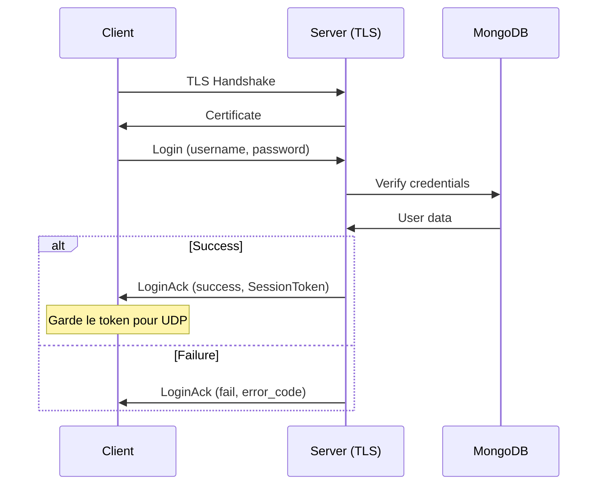
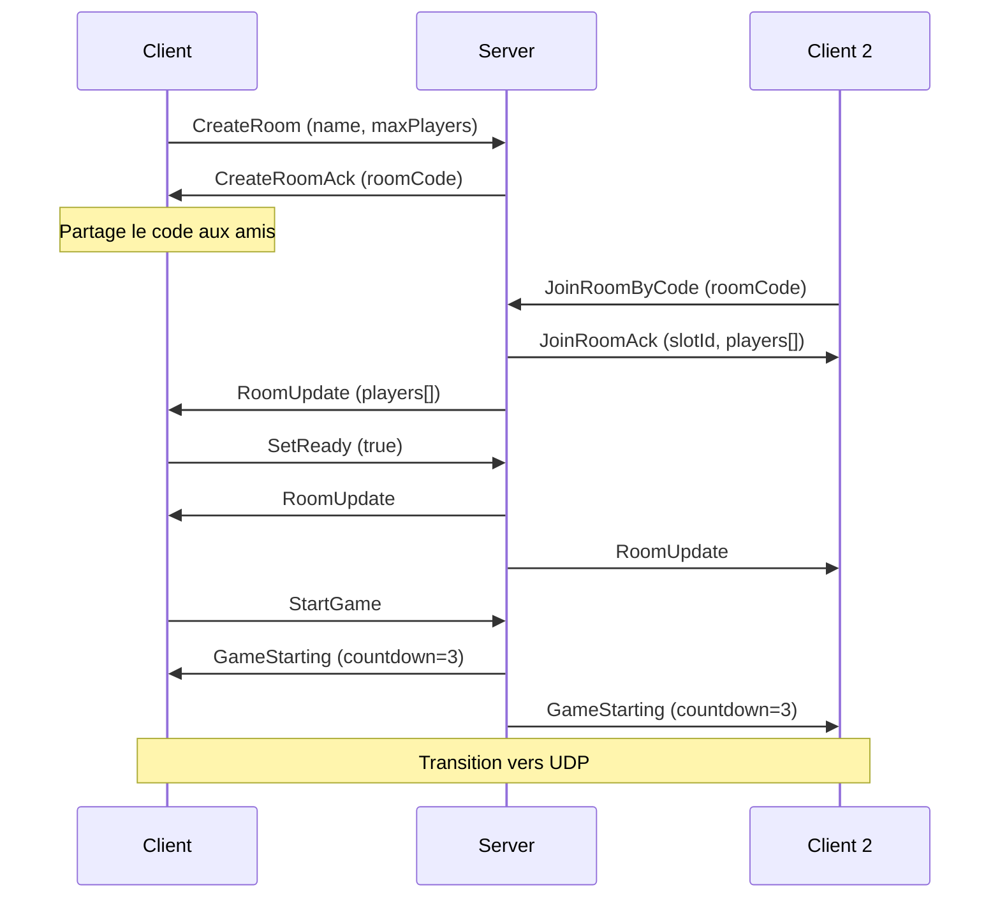

---
tags:
  - technique
  - reseau
  - tcp
---

# Protocole TCP

Utilisé pour les opérations **fiables** : authentification TLS, rooms, chat.

## Port

`4125/TCP` (TLS 1.2+)

---

## Header TCP (7 bytes)

```cpp
struct Header {
    uint8_t  isAuthenticated;  // 1 byte - 0 ou 1
    uint16_t type;             // 2 bytes (network byte order)
    uint32_t payload_size;     // 4 bytes (network byte order)
};
```

---

## Types de Messages

### Authentification

| Type | Value | Direction | Description |
|------|-------|-----------|-------------|
| `Login` | `0x0100` | C→S | Demande connexion |
| `LoginAck` | `0x0101` | S→C | Résultat + SessionToken |
| `Register` | `0x0102` | C→S | Création compte |
| `RegisterAck` | `0x0103` | S→C | Résultat inscription |

### Gestion des Rooms

| Type | Value | Direction | Description |
|------|-------|-----------|-------------|
| `CreateRoom` | `0x0200` | C→S | Créer une room |
| `CreateRoomAck` | `0x0201` | S→C | Room créée + code |
| `JoinRoomByCode` | `0x0210` | C→S | Rejoindre par code |
| `JoinRoomAck` | `0x0211` | S→C | Accès accordé |
| `JoinRoomNack` | `0x0212` | S→C | Accès refusé |
| `LeaveRoom` | `0x0220` | C→S | Quitter room |
| `SetReady` | `0x0230` | C→S | Prêt à jouer |
| `StartGame` | `0x0240` | C→S | Lancer partie (host) |
| `RoomUpdate` | `0x0250` | S→C | État room (broadcast) |
| `GameStarting` | `0x0251` | S→C | Countdown démarrage |

### Room Browser & Quick Join

| Type | Value | Direction | Description |
|------|-------|-----------|-------------|
| `BrowsePublicRooms` | `0x0270` | C→S | Liste rooms publiques |
| `BrowsePublicRoomsAck` | `0x0271` | S→C | Liste des rooms |
| `QuickJoin` | `0x0272` | C→S | Rejoindre auto |
| `QuickJoinAck` | `0x0273` | S→C | Room trouvée |
| `QuickJoinNack` | `0x0274` | S→C | Aucune room |

### User Settings

| Type | Value | Direction | Description |
|------|-------|-----------|-------------|
| `GetUserSettings` | `0x0280` | C→S | Récupérer settings |
| `GetUserSettingsAck` | `0x0281` | S→C | Settings utilisateur |
| `SaveUserSettings` | `0x0282` | C→S | Sauvegarder settings |
| `SaveUserSettingsAck` | `0x0283` | S→C | Confirmation |

### Chat

| Type | Value | Direction | Description |
|------|-------|-----------|-------------|
| `SendChatMessage` | `0x0290` | C→S | Envoyer message |
| `SendChatMessageAck` | `0x0291` | S→C | Confirmation |
| `ChatMessageBroadcast` | `0x0292` | S→C | Broadcast message |
| `ChatHistory` | `0x0293` | S→C | Historique (on join) |

---

## Structures Clés

### LoginMessage

```cpp
struct LoginMessage {
    char username[32];
    char password[64];
};
```

### AuthResponseWithToken (succès login)

```cpp
struct AuthResponseWithToken {
    bool success;                    // 1 byte
    char error_code[32];             // 32 bytes
    char message[128];               // 128 bytes
    SessionToken token;              // 32 bytes - Pour auth UDP
};
```

### SessionToken

```cpp
// 32 bytes (256 bits) - Généré avec CSPRNG
struct SessionToken {
    uint8_t bytes[32];
};
```

### RoomPlayerState

```cpp
struct RoomPlayerState {
    uint8_t slotId;              // 0-5
    uint8_t occupied;            // 0 = vide, 1 = occupé
    char displayName[32];
    char email[255];
    uint8_t isReady;
    uint8_t isHost;
    uint8_t shipSkin;            // 1-6
};
```

### CreateRoomRequest

```cpp
struct CreateRoomRequest {
    char name[32];
    uint8_t maxPlayers;  // 2-6
    uint8_t isPrivate;   // 0 = public, 1 = private
};
```

---

## Séquence d'Authentification



---

## Séquence Room



---

## TLS Configuration

| Paramètre | Valeur |
|-----------|--------|
| Version minimale | TLS 1.2 |
| Cipher suites | ECDHE + AES-GCM / ChaCha20-Poly1305 |
| Certificat | `certs/server.crt` |
| Clé privée | `certs/server.key` |

```bash
# Générer les certificats de dev
./scripts/generate_dev_certs.sh
```

---

## Constantes

| Constante | Valeur | Description |
|-----------|--------|-------------|
| `MAX_USERNAME_LEN` | 32 | Taille max username |
| `MAX_PASSWORD_LEN` | 64 | Taille max password |
| `MAX_EMAIL_LEN` | 255 | Taille max email |
| `TOKEN_SIZE` | 32 | Taille SessionToken |
| `ROOM_NAME_LEN` | 32 | Taille nom de room |
| `ROOM_CODE_LEN` | 6 | Taille code d'invitation |
| `MAX_ROOM_PLAYERS` | 6 | Joueurs max par room |
| `CLIENT_TIMEOUT_MS` | 2000 | Timeout déconnexion |
