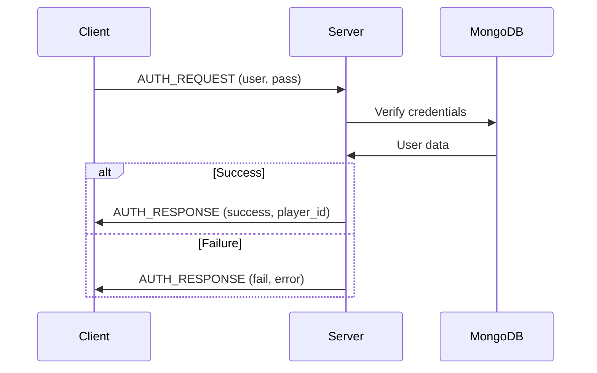
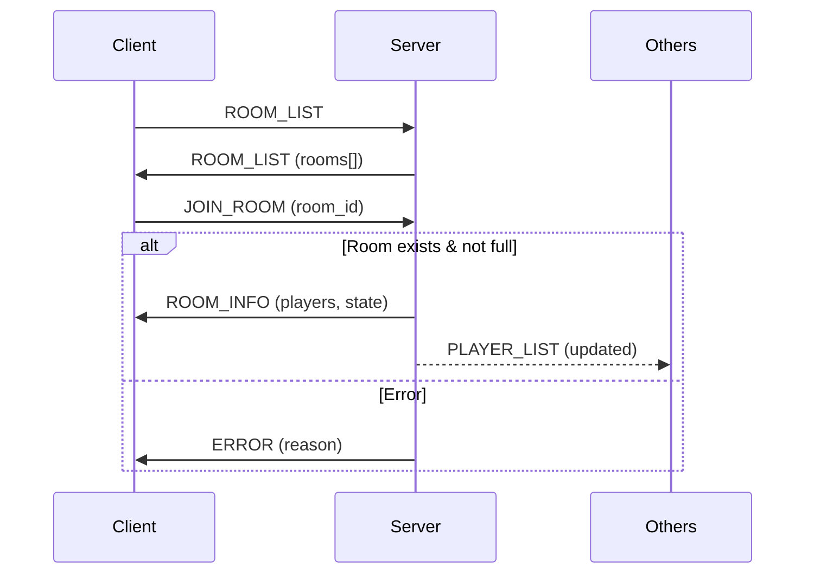

---
tags:
  - technique
  - reseau
  - tcp
---

# Protocole TCP

Utilisé pour les opérations **fiables** : authentification, rooms, chat.

## Port

`4242/TCP`

---

## Types de Paquets

| ID | Type | Direction | Description |
|----|------|-----------|-------------|
| `0x01` | `AUTH_REQUEST` | C→S | Demande connexion |
| `0x02` | `AUTH_RESPONSE` | S→C | Résultat auth |
| `0x03` | `CREATE_ROOM` | C→S | Créer room |
| `0x04` | `JOIN_ROOM` | C→S | Rejoindre room |
| `0x05` | `LEAVE_ROOM` | C→S | Quitter room |
| `0x06` | `ROOM_LIST` | S→C | Liste rooms |
| `0x07` | `ROOM_INFO` | S→C | Info room |
| `0x10` | `CHAT_MESSAGE` | C↔S | Message texte |
| `0x11` | `PLAYER_LIST` | S→C | Liste joueurs |
| `0x20` | `GAME_START` | S→C | Partie lance |
| `0xFF` | `ERROR` | S→C | Erreur |

---

## Structures

### AUTH_REQUEST

```cpp
struct AuthRequest {
    char username[32];
    char password_hash[64];
};
```

### AUTH_RESPONSE

```cpp
struct AuthResponse {
    uint8_t success;      // 0 = fail, 1 = success
    uint32_t player_id;   // Si success
    char error_msg[128];  // Si fail
};
```

### CREATE_ROOM

```cpp
struct CreateRoom {
    char room_name[32];
    uint8_t max_players;  // 1-4
    uint8_t is_private;
};
```

### JOIN_ROOM

```cpp
struct JoinRoom {
    uint32_t room_id;
    char password[32];  // Si room privée
};
```

### CHAT_MESSAGE

```cpp
struct ChatMessage {
    uint32_t sender_id;
    uint32_t room_id;
    uint64_t timestamp;
    char message[256];
};
```

---

## Séquence d'Authentification



---

## Séquence Room



---

## Implémentation

### Serveur (Boost.ASIO)

```cpp
class TCPServer {
    boost::asio::io_context& io_;
    tcp::acceptor acceptor_;
    std::map<uint32_t, std::shared_ptr<Session>> sessions_;

public:
    TCPServer(boost::asio::io_context& io, uint16_t port)
        : io_(io)
        , acceptor_(io, tcp::endpoint(tcp::v4(), port))
    {
        accept();
    }

private:
    void accept() {
        acceptor_.async_accept([this](auto ec, tcp::socket socket) {
            if (!ec) {
                auto session = std::make_shared<Session>(
                    std::move(socket));
                sessions_[session->id()] = session;
                session->start();
            }
            accept();
        });
    }
};
```

### Client

```cpp
class TCPClient {
    boost::asio::io_context& io_;
    tcp::socket socket_;

public:
    void connect(const std::string& host, uint16_t port) {
        tcp::resolver resolver(io_);
        auto endpoints = resolver.resolve(host, std::to_string(port));
        boost::asio::connect(socket_, endpoints);
    }

    void send(const Packet& packet) {
        auto buffer = packet.serialize();
        boost::asio::write(socket_, boost::asio::buffer(buffer));
    }

    Packet receive() {
        PacketHeader header;
        boost::asio::read(socket_,
            boost::asio::buffer(&header, sizeof(header)));

        std::vector<uint8_t> data(header.size);
        boost::asio::read(socket_, boost::asio::buffer(data));

        return Packet::deserialize(header, data);
    }
};
```

---

## Codes d'Erreur

| Code | Description |
|------|-------------|
| `0x01` | Auth failed |
| `0x02` | Room not found |
| `0x03` | Room full |
| `0x04` | Already in room |
| `0x05` | Not in room |
| `0x06` | Permission denied |
