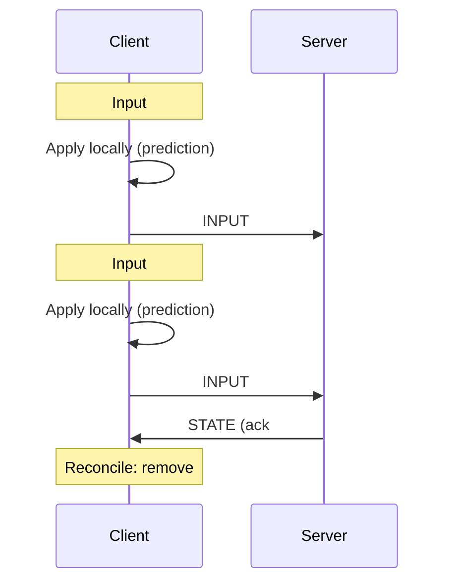

---
tags:
  - technique
  - reseau
  - udp
---

# Protocole UDP

Utilisé pour la **synchronisation du jeu** en temps réel.

## Port

`4242/UDP`

---

## Types de Paquets

| ID | Type | Direction | Description |
|----|------|-----------|-------------|
| `0x01` | `INPUT` | C→S | Actions joueur |
| `0x02` | `STATE` | S→C | État du monde |
| `0x03` | `SPAWN` | S→C | Nouvelle entité |
| `0x04` | `DESTROY` | S→C | Entité détruite |
| `0x05` | `HIT` | S→C | Collision/dégâts |
| `0x06` | `SCORE` | S→C | Score update |
| `0x10` | `PING` | C↔S | Mesure latence |
| `0x11` | `PONG` | C↔S | Réponse ping |

---

## Structures

### INPUT

```cpp
struct InputPacket {
    uint32_t sequence;
    uint32_t player_id;
    uint8_t keys;        // Bitmask: UP|DOWN|LEFT|RIGHT|SHOOT
    float timestamp;
};

// Keys bitmask
enum Keys : uint8_t {
    KEY_UP    = 0x01,
    KEY_DOWN  = 0x02,
    KEY_LEFT  = 0x04,
    KEY_RIGHT = 0x08,
    KEY_SHOOT = 0x10
};
```

### STATE

```cpp
struct StatePacket {
    uint32_t tick;
    uint32_t entity_count;
    EntityState entities[];  // Variable length
};

struct EntityState {
    uint32_t entity_id;
    uint8_t type;         // Player, Enemy, Missile, etc.
    float x, y;
    float vx, vy;
    int16_t health;
};
```

### SPAWN

```cpp
struct SpawnPacket {
    uint32_t entity_id;
    uint8_t type;
    float x, y;
    uint32_t owner_id;    // Pour missiles
};
```

### DESTROY

```cpp
struct DestroyPacket {
    uint32_t entity_id;
    uint8_t reason;       // 0=killed, 1=out_of_bounds, 2=timeout
};
```

---

## Game Loop Réseau

### Serveur (60 ticks/sec)

```cpp
void GameServer::tick() {
    // 1. Process all pending inputs
    while (auto input = inputQueue_.pop()) {
        processInput(*input);
    }

    // 2. Update game world
    world_.update(TICK_DURATION);

    // 3. Broadcast state
    StatePacket state = world_.serialize();
    for (auto& [id, session] : sessions_) {
        udp_.sendTo(state, session.endpoint);
    }

    currentTick_++;
}
```

### Client (Frame-based)

```cpp
void GameClient::update(float dt) {
    // 1. Collect input
    InputPacket input = collectInput();
    input.sequence = ++inputSequence_;

    // 2. Client-side prediction
    localPlayer_.applyInput(input);
    pendingInputs_.push_back(input);

    // 3. Send to server
    udp_.send(input);

    // 4. Interpolate other entities
    interpolateEntities(dt);
}

void GameClient::onStateReceived(const StatePacket& state) {
    // Reconciliation
    reconcile(state);
}
```

---

## Client-Side Prediction



### Implémentation

```cpp
void GameClient::reconcile(const StatePacket& state) {
    // Find our player in server state
    auto serverPos = state.getPlayerPosition(playerId_);

    // Remove acknowledged inputs
    pendingInputs_.erase(
        std::remove_if(pendingInputs_.begin(), pendingInputs_.end(),
            [&](auto& i) { return i.sequence <= state.lastAck; }),
        pendingInputs_.end()
    );

    // Re-apply pending inputs from server position
    localPlayer_.position = serverPos;
    for (auto& input : pendingInputs_) {
        localPlayer_.applyInput(input);
    }
}
```

---

## Interpolation

Pour les entités distantes :

```cpp
void GameClient::interpolateEntities(float dt) {
    float t = interpolationTime_ / SERVER_TICK_DURATION;

    for (auto& [id, entity] : entities_) {
        if (id == localPlayerId_) continue;  // Pas d'interpolation locale

        auto* prev = findState(id, previousTick_);
        auto* next = findState(id, currentTick_);

        if (prev && next) {
            entity.position = lerp(prev->position, next->position, t);
        }
    }

    interpolationTime_ += dt;
    if (interpolationTime_ >= SERVER_TICK_DURATION) {
        interpolationTime_ = 0;
        previousTick_ = currentTick_;
    }
}
```

---

## Gestion de la Perte de Paquets

UDP ne garantit pas la livraison. Stratégies :

| Stratégie | Description |
|-----------|-------------|
| **Sequence numbers** | Détecter les paquets manquants |
| **Delta compression** | Envoyer seulement les changements |
| **Redundancy** | Répéter les infos critiques |
| **Timeout** | Considérer le joueur déconnecté |
