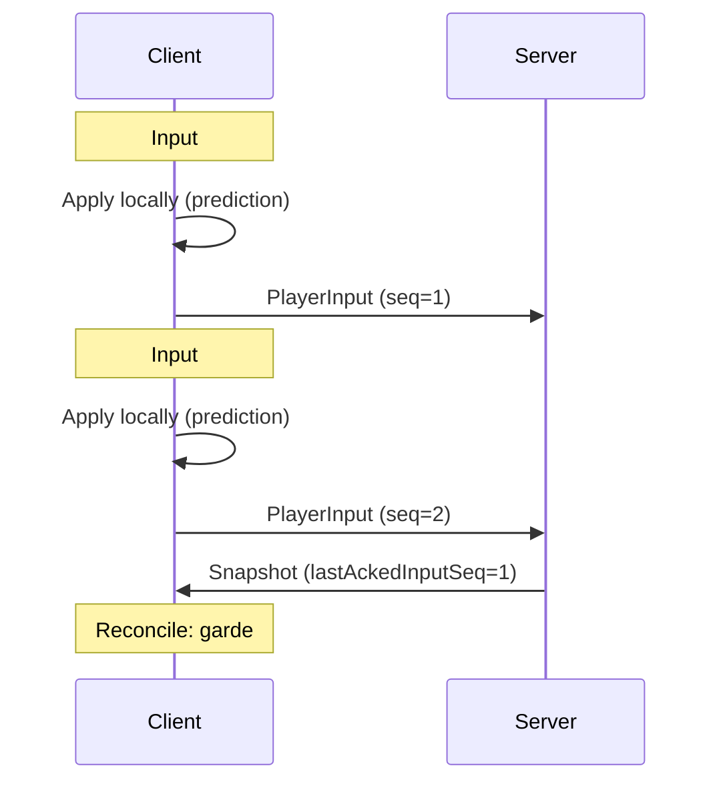

---
tags:
  - technique
  - reseau
  - udp
---

# Protocole UDP

Utilisé pour la **synchronisation du jeu** en temps réel.

## Port

`4124/UDP`

---

## Header UDP (12 bytes)

Tous les messages UDP commencent par ce header :

```cpp
struct UDPHeader {
    uint16_t type;          // 2 bytes (network byte order)
    uint16_t sequence_num;  // 2 bytes (network byte order)
    uint64_t timestamp;     // 8 bytes (millisecondes depuis epoch)
};
```

---

## Types de Messages

| Type | Value | Direction | Description |
|------|-------|-----------|-------------|
| `HeartBeat` | `0x0001` | Both | Keep-alive |
| `HeartBeatAck` | `0x0002` | S→C | Réponse heartbeat |
| `JoinGame` | `0x0010` | C→S | Auth UDP (token + roomCode) |
| `JoinGameAck` | `0x0011` | S→C | player_id assigné |
| `JoinGameNack` | `0x0012` | S→C | Rejet (token invalide) |
| `Snapshot` | `0x0040` | S→C | État complet du jeu (20Hz) |
| `PlayerInput` | `0x0061` | C→S | Inputs du joueur |
| `PlayerJoin` | `0x0070` | S→C | Nouveau joueur |
| `PlayerLeave` | `0x0071` | S→C | Joueur déconnecté |
| `ShootMissile` | `0x0080` | C→S | Demande de tir |
| `MissileSpawned` | `0x0081` | S→C | Missile créé |
| `MissileDestroyed` | `0x0082` | S→C | Missile détruit |
| `EnemyDestroyed` | `0x0091` | S→C | Ennemi détruit |
| `PlayerDamaged` | `0x00A0` | S→C | Joueur touché |
| `PlayerDied` | `0x00A1` | S→C | Joueur mort |

---

## Structures

### PlayerInput (4 bytes)

**IMPORTANT** : Le client envoie les **touches pressées**, pas la position !

```cpp
struct PlayerInput {
    uint16_t keys;         // Bitfield des touches (network order)
    uint16_t sequenceNum;  // Pour réconciliation client-side
};

// Bitfield des touches
namespace InputKeys {
    constexpr uint16_t UP    = 0x0001;
    constexpr uint16_t DOWN  = 0x0002;
    constexpr uint16_t LEFT  = 0x0004;
    constexpr uint16_t RIGHT = 0x0008;
    constexpr uint16_t SHOOT = 0x0010;
}
```

### JoinGame (39 bytes)

```cpp
struct JoinGame {
    SessionToken token;      // 32 bytes - Token du login TCP
    uint8_t shipSkin;        // 1 byte - Skin vaisseau (1-6)
    char roomCode[6];        // 6 bytes - Code de la room
};
```

### PlayerState (10 bytes)

```cpp
struct PlayerState {
    uint8_t  id;              // 1 byte
    uint16_t x;               // 2 bytes (network order)
    uint16_t y;               // 2 bytes (network order)
    uint8_t  health;          // 1 byte (0-100)
    uint8_t  alive;           // 1 byte (0 ou 1)
    uint16_t lastAckedInputSeq; // 2 bytes - Pour réconciliation
    uint8_t  shipSkin;        // 1 byte (1-6)
};
```

### MissileState (7 bytes)

```cpp
struct MissileState {
    uint16_t id;        // 2 bytes
    uint8_t  owner_id;  // 1 byte (0xFF = ennemi)
    uint16_t x;         // 2 bytes
    uint16_t y;         // 2 bytes
};
```

### EnemyState (8 bytes)

```cpp
struct EnemyState {
    uint16_t id;         // 2 bytes
    uint16_t x;          // 2 bytes
    uint16_t y;          // 2 bytes
    uint8_t  health;     // 1 byte
    uint8_t  enemy_type; // 1 byte
};
```

### GameSnapshot (variable)

```cpp
struct GameSnapshot {
    uint8_t player_count;
    PlayerState players[MAX_PLAYERS];        // MAX = 4
    uint8_t missile_count;
    MissileState missiles[MAX_MISSILES];     // MAX = 32
    uint8_t enemy_count;
    EnemyState enemies[MAX_ENEMIES];         // MAX = 16
    uint8_t enemy_missile_count;
    MissileState enemy_missiles[MAX_ENEMY_MISSILES]; // MAX = 32
};
```

---

## Game Loop Réseau

### Serveur (Broadcast 20 Hz)

```cpp
static constexpr int BROADCAST_INTERVAL_MS = 50;  // 20 Hz

void UDPServer::scheduleBroadcast() {
    _broadcastTimer.expires_after(
        std::chrono::milliseconds(BROADCAST_INTERVAL_MS));
    _broadcastTimer.async_wait([this](auto ec) {
        if (!ec) {
            broadcastSnapshots();  // Envoie GameSnapshot à tous
            scheduleBroadcast();
        }
    });
}
```

### Client (Frame-based)

```cpp
void GameScene::update(float dt) {
    // 1. Collecter les inputs
    uint16_t keys = 0;
    if (isKeyPressed(Key::Up))    keys |= InputKeys::UP;
    if (isKeyPressed(Key::Down))  keys |= InputKeys::DOWN;
    if (isKeyPressed(Key::Left))  keys |= InputKeys::LEFT;
    if (isKeyPressed(Key::Right)) keys |= InputKeys::RIGHT;

    // 2. Envoyer au serveur
    _udpClient->sendInput(keys);

    // 3. Client-side prediction
    applyInputLocally(keys, dt);

    // 4. Réconcilier avec le snapshot serveur
    reconcileWithServer();
}
```

---

## Client-Side Prediction



### Réconciliation

```cpp
void GameScene::reconcileWithServer() {
    auto snapshot = _udpClient->getLatestSnapshot();
    auto& myState = findMyPlayer(snapshot);

    // Supprimer les inputs déjà traités par le serveur
    _pendingInputs.erase(
        std::remove_if(_pendingInputs.begin(), _pendingInputs.end(),
            [&](auto& i) { return i.seq <= myState.lastAckedInputSeq; }),
        _pendingInputs.end()
    );

    // Partir de la position serveur
    _localPlayer.x = myState.x;
    _localPlayer.y = myState.y;

    // Réappliquer les inputs non encore traités
    for (auto& input : _pendingInputs) {
        applyInputLocally(input.keys, TICK_DURATION);
    }
}
```

---

## Constantes

| Constante | Valeur | Description |
|-----------|--------|-------------|
| `BROADCAST_INTERVAL_MS` | 50 | Intervalle snapshot (20 Hz) |
| `PLAYER_TIMEOUT_MS` | 2000 | Timeout déconnexion |
| `MAX_PLAYERS` | 4 | Joueurs max par partie |
| `MAX_MISSILES` | 32 | Missiles joueurs max |
| `MAX_ENEMIES` | 16 | Ennemis max |
| `MAX_ENEMY_MISSILES` | 32 | Missiles ennemis max |

---

## Gestion de la Perte de Paquets

UDP ne garantit pas la livraison. Stratégies utilisées :

| Stratégie | Description |
|-----------|-------------|
| **Sequence numbers** | Détecter les paquets manquants via `lastAckedInputSeq` |
| **Full state** | Snapshot contient l'état complet (pas de delta) |
| **Redundancy** | 20 snapshots/sec compense la perte |
| **Timeout** | Joueur déconnecté après 2000ms sans heartbeat |
