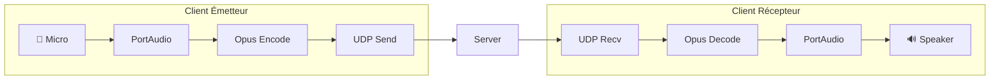

---
tags:
  - technique
  - reseau
  - voice
---

# Protocole Voice

Communication audio temps réel avec **Opus** codec.

## Port

`4243/UDP`

---

## Technologies

| Composant | Technologie |
|-----------|-------------|
| **Codec** | Opus |
| **Capture** | PortAudio |
| **Transport** | UDP |

---

## Types de Paquets

| ID | Type | Direction | Description |
|----|------|-----------|-------------|
| `0x01` | `VOICE_DATA` | C↔S | Données audio |
| `0x02` | `VOICE_MUTE` | C→S | Joueur se mute |
| `0x03` | `VOICE_UNMUTE` | C→S | Joueur se unmute |
| `0x04` | `VOICE_LEVEL` | S→C | Niveau audio |

---

## Structure VOICE_DATA

```cpp
struct VoiceDataPacket {
    uint32_t sender_id;
    uint32_t sequence;
    uint64_t timestamp;
    uint16_t opus_length;
    uint8_t opus_data[];  // Variable length
};
```

---

## Paramètres Opus

| Paramètre | Valeur | Description |
|-----------|--------|-------------|
| **Sample Rate** | 48000 Hz | Qualité studio |
| **Channels** | 1 (mono) | Voix uniquement |
| **Frame Size** | 960 samples | 20ms à 48kHz |
| **Bitrate** | 24000 bps | Qualité/BP |
| **Complexity** | 5 | Équilibré |

---

## Architecture



---

## Implémentation

### VoiceChatManager

```cpp
class VoiceChatManager {
    OpusEncoder* encoder_;
    OpusDecoder* decoder_;
    PaStream* inputStream_;
    PaStream* outputStream_;
    UDPSocket& socket_;

    std::queue<VoiceDataPacket> incoming_;
    bool muted_ = false;

public:
    VoiceChatManager(UDPSocket& socket)
        : socket_(socket)
    {
        // Init Opus
        int error;
        encoder_ = opus_encoder_create(48000, 1,
            OPUS_APPLICATION_VOIP, &error);
        decoder_ = opus_decoder_create(48000, 1, &error);

        opus_encoder_ctl(encoder_,
            OPUS_SET_BITRATE(24000));

        // Init PortAudio
        Pa_Initialize();
        setupStreams();
    }

    void capture() {
        if (muted_) return;

        float samples[960];
        Pa_ReadStream(inputStream_, samples, 960);

        // Encode
        uint8_t encoded[256];
        int len = opus_encode_float(encoder_,
            samples, 960, encoded, 256);

        // Send
        VoiceDataPacket packet{
            .sender_id = localPlayerId_,
            .sequence = ++sequence_,
            .timestamp = now(),
            .opus_length = static_cast<uint16_t>(len)
        };
        std::memcpy(packet.opus_data, encoded, len);

        socket_.broadcast(packet);
    }

    void playback() {
        while (!incoming_.empty()) {
            auto& packet = incoming_.front();

            // Decode
            float samples[960];
            opus_decode_float(decoder_,
                packet.opus_data, packet.opus_length,
                samples, 960, 0);

            // Play
            Pa_WriteStream(outputStream_, samples, 960);

            incoming_.pop();
        }
    }
};
```

---

## Push-to-Talk vs VAD

### PTT

```cpp
void VoiceChatManager::setPTT(bool pressed) {
    if (pressed && !muted_) {
        capturing_ = true;
    } else {
        capturing_ = false;
    }
}
```

### VAD (Voice Activity Detection)

```cpp
bool VoiceChatManager::detectVoice(float* samples, int count) {
    float energy = 0;
    for (int i = 0; i < count; i++) {
        energy += samples[i] * samples[i];
    }
    energy /= count;

    return energy > vadThreshold_;
}
```

---

## Jitter Buffer

Pour gérer les variations de latence :

```cpp
class JitterBuffer {
    std::map<uint32_t, VoiceDataPacket> buffer_;
    uint32_t playbackSeq_ = 0;
    static constexpr int BUFFER_SIZE = 3;  // 60ms

public:
    void push(VoiceDataPacket packet) {
        buffer_[packet.sequence] = std::move(packet);
    }

    std::optional<VoiceDataPacket> pop() {
        // Wait until we have enough buffer
        if (buffer_.size() < BUFFER_SIZE)
            return std::nullopt;

        auto it = buffer_.find(playbackSeq_++);
        if (it != buffer_.end()) {
            auto packet = std::move(it->second);
            buffer_.erase(it);
            return packet;
        }

        // Packet lost - generate silence or interpolate
        return generateSilence();
    }
};
```

---

## Latence

| Composant | Latence |
|-----------|---------|
| Capture | ~10ms |
| Encoding | ~20ms |
| Network | Variable |
| Jitter buffer | ~60ms |
| Decoding | ~20ms |
| Playback | ~10ms |
| **Total** | ~120ms + network |
