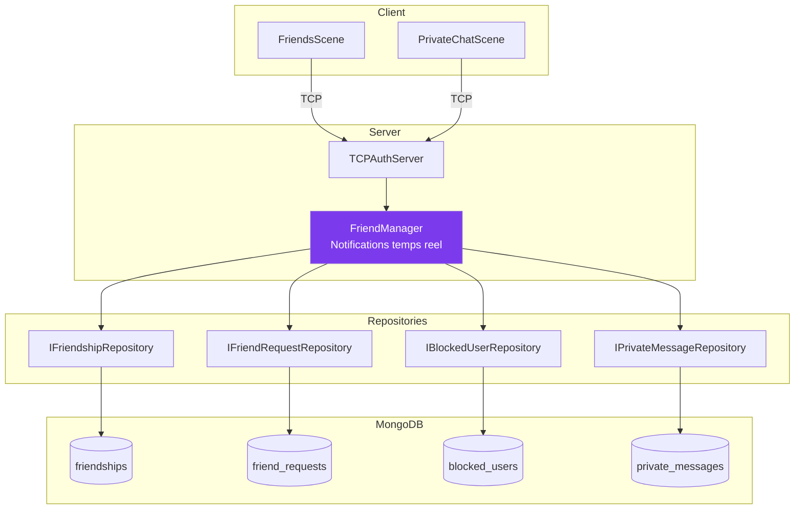

---
tags:
  - technique
  - social
  - friends
  - messaging
---

# Systeme Social

Architecture du systeme d'amis et de messagerie privee.

---

## Architecture

---

## Fonctionnalites

| Fonctionnalite | Description |
|----------------|-------------|
| Demandes d'amis | Envoyer/accepter/refuser |
| Liste d'amis | Gestion des relations |
| Blocage | Bloquer/debloquer des utilisateurs |
| Messages prives | Communication 1-to-1 |
| Statut en ligne | Notifications temps reel |

---

## Protocol TCP

Le systeme utilise TCP (port 4125) pour garantir la livraison des messages.

| Plage | Fonctionnalite |
|-------|----------------|
| 0x0600-0x0650 | Amis (demandes, acceptation, blocage, statut) |
| 0x0660-0x0681 | Messages prives (envoi, reception, historique) |

---

## Composants Cles

### Server

| Composant | Role |
|-----------|------|
| `FriendManager` | Gestionnaire de notifications temps reel |
| `IFriendshipRepository` | Interface persistance amities |
| `IFriendRequestRepository` | Interface persistance demandes |
| `IBlockedUserRepository` | Interface persistance blocage |
| `IPrivateMessageRepository` | Interface persistance messages |

### Client

| Composant | Role |
|-----------|------|
| `FriendsScene` | Interface utilisateur amis |
| `PrivateChatScene` | Interface chat prive |

---

## Documentation

  

    <h3><a href="../../friends-system/">Friends System</a></h3>
    
Protocol wire, structures, codes d'erreur

  

